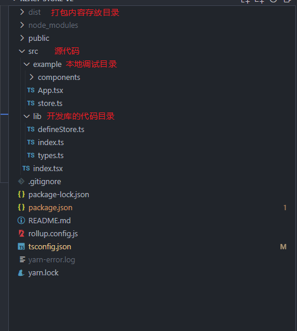

# react开发npm库

使用 `rollup3` + `typescript4`

使用 `rollup`的原因是这东西更适合打包库，打包的代码体积小，`webpack`更适合打包应用。

`rollup`只是一个纯粹的`esm`打包器，默认使用`esm`模块规范进行打包，自带t`ree-sharking`。

## 遇到的坑

一开始的目录设想是，`npm`包里面有一个`example`的本地调试目录，但是这个目录单独安装`react`依赖，包自己也有依赖。这样子进行调试就会导致`react`报错，不能同时使用两个`react`依赖，不得已项目只用一个react依赖，`example`目录靠npm包的`react`依赖运行运行。


## 目录结构



## roullp 配置文件

```js
const path = require("path");

const resolve = require("@rollup/plugin-node-resolve");
const { terser } = require("rollup-plugin-terser");
const ts = require("rollup-plugin-typescript2");
const commonjs = require('rollup-plugin-commonjs');

module.exports = {
  input: "src/lib/index.ts", // 打包入口
  output: [
    {
      file: "dist/index.js", // 输出的文件
      format: "cjs", // 文件模块规范
    },
  ],
  plugins: [
    commonjs(), // 解析 commonjs规范的模块
    // 打包插件
    resolve(), // rollup导入语法只能导入本地文件，这里用于转换语法，告诉导入的是第三方库
    terser(), // 压缩代码和去除注释
    ts({ // 解析 typescript
      tsconfig: path.resolve(__dirname, "tsconfig.json"),
      extensions: [".js", ".ts", ".tsx"], // 解析的扩展名
    }),
  ],
  external: ['react', 'react-dom'], // 声明使用的第三方外部模块，要不然打包就会报错
};

```

