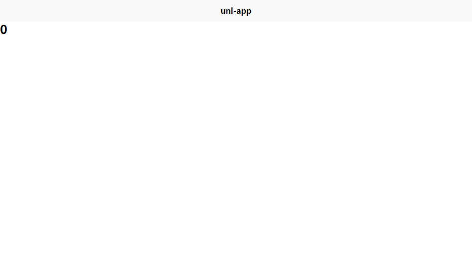
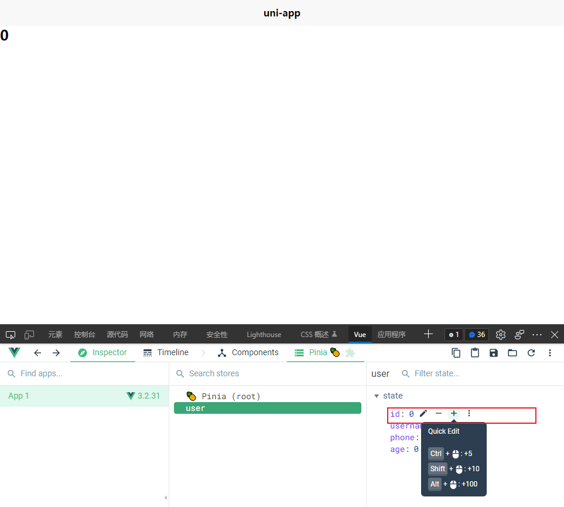
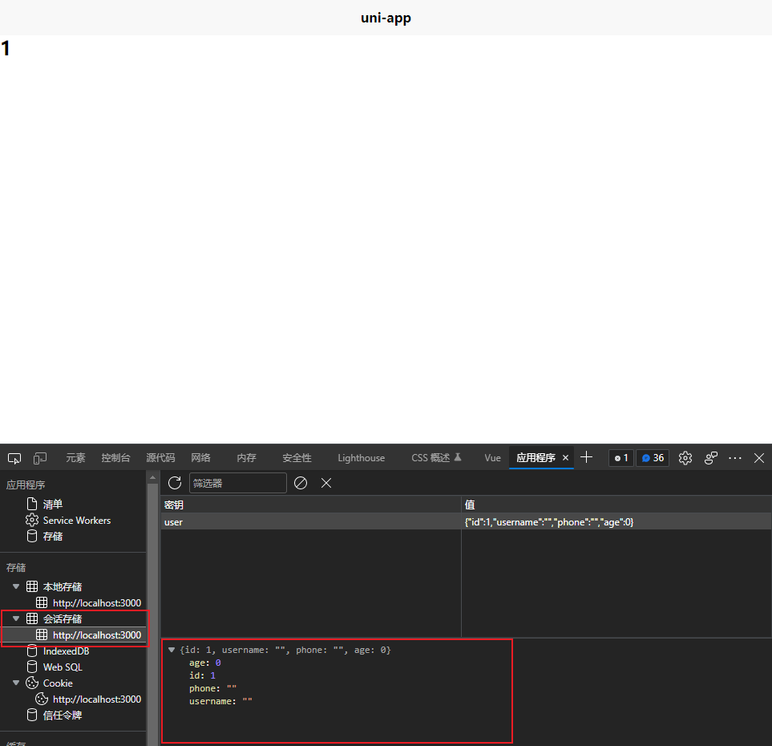
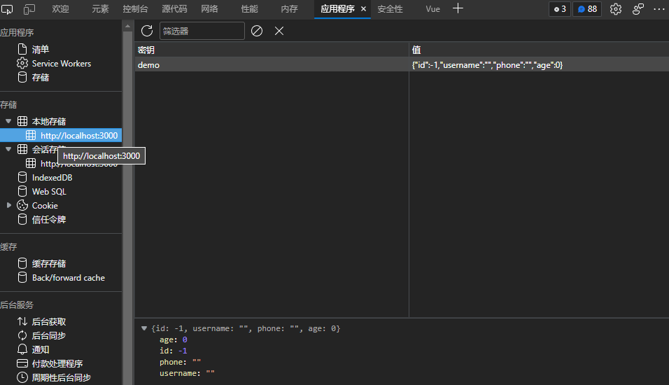
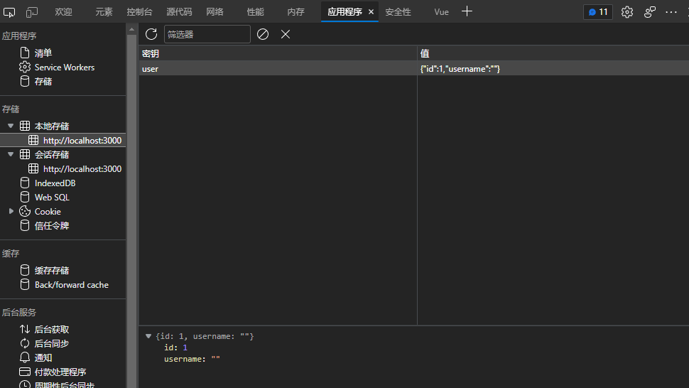
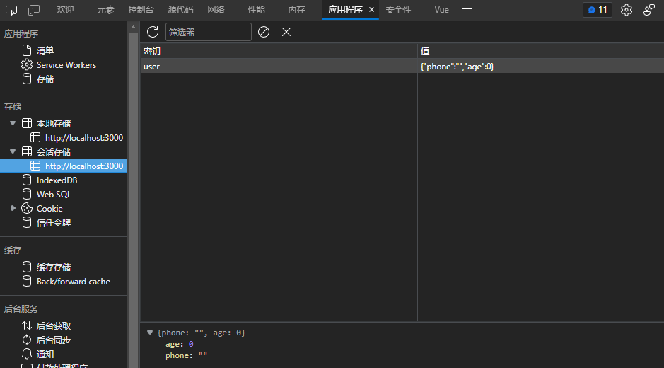

# 搭建项目

环境：

- unipp + vue3
- typescript
- chrome
- vscode
- node.js: v14.18.3
- npm: 6.14.15
- yarn: 1.22.17

创建项目

- 创建以 typescript 开发的工程（如命令行创建失败，请直接访问[gitee]([下载仓库 · DCloud/uni-preset-vue - Gitee.com](https://gitee.com/dcloud/uni-preset-vue/repository/archive/vite-ts.zip))下载模板）

  ```sh
  npx degit dcloudio/uni-preset-vue#vite-ts my-vue3-project
  ```

安装依赖

```
yarn install
```

移除内置的vuex

```
yarn remove vuex
```

添加`pinia`

```
yarn add pinia
```

在`src/main.ts`入口文件引入`pinia`：

```typescript
import { createSSRApp } from "vue";
import App from "./App.vue";
import { createPinia } from 'pinia'

export function createApp() {
  const app = createSSRApp(App);
  app.use(createPinia())
  return {
    app,
  };
}
```

新建`src/index.ts`，`src/modules/user.ts`和`src/modules/cart.ts`文件

`src/modules/user.ts`

```typescript
import { defineStore } from 'pinia'

export const useUserStore = defineStore('user', {
  state: () => ({
    id: 0,
    username: '',
    phone: '',
    age: 0,
  })
})

```

`src/modules/cart.ts`

```typescript
import { defineStore } from 'pinia'

export const useCartStore = defineStore('cart', {
  state: () => ({
    cartNumber: 0
  })
})
```

`src/index.ts`

```typescript
export * from './modules/carts';
export * from './modules/user';
```

在`src/pages/index/index.vue`中使用，修改`index.vue`的代码为：

```vue
<template>
  <h2>
    {{userStore.id}}
  </h2>
</template>

<script setup lang="ts">

import * as store from '../../store'

const userStore = store.useUserStore();

</script>


```

执行命令`yarn dev:h5`，打开浏览器`http://localhost:3000/`



# pinia 数据持久化

安装 [pinia-plugin-persist](https://seb-l.github.io/pinia-plugin-persist/#vue2)

```
yarn add pinia-plugin-persist
```

修改`src/main.ts`

```typescript
import { createSSRApp } from "vue";
import App from "./App.vue";
import { createPinia } from 'pinia'

import piniaPersist from 'pinia-plugin-persist'

const pinia = createPinia();
pinia.use(piniaPersist);


export function createApp() {
  const app = createSSRApp(App);
  app.use(pinia)
  return {
    app,
  };
}
```

## 基本使用

在pinia使用持久化插件后，整个状态默认储存在sessionStorage中。

store `id`默认作为storage key

修改`modules/user.ts`代码：

```typescript
import { defineStore } from 'pinia'

export const useUserStore = defineStore('user', {
  state: () => ({
    id: 0,
    username: '',
    phone: '',
    age: 0,
  }),
  persist: {
    enabled: true,
  }
})
```

执行命令`yarn dev:h5`，打开浏览器`http://localhost:3000/`，在开发者工具修改pinia的user store，pinia的状态改变后，sessionStorage将会进行储存。




在应用程序里面查看会话储存



### 注意：

每次修改`pinia`的持久化相关代码，在开发工具查看的时候，要记得清掉缓存，然后刷新，再继续操作才能看到效果。

## 高级使用

### 策略

 `pinia-plugin-persist` 可以使用多种策略来持久`store`数据，可以在store的`persist`键中定义策略列表。

```typescript
import { defineStore } from 'pinia'

export const useUserStore = defineStore('user', {
  state: () => ({
    id: 0,
    username: '',
    phone: '',
    age: 0,
  }),
  persist: {
    enabled: true,
    strategies: [],
  }
})

```

`strategies` 的 策略类型

```typescript
interface PersistStrategy {
  key?: string; // Storage key
  storage?: Storage; // 实际 storage (默认值: sessionStorage)
  paths?: string[]; // 列出你想要储存在 store 的 state key
}
```

#### 自定义storage key

你可以通过在每个策略中设置一个自定义的存储`key`。

在下面这个示例中，整个状态将储存在localStorage中的`demo key`中。

`store/modules/user.ts`

```typescript
import { defineStore } from 'pinia'

export const useUserStore = defineStore('user', {
  state: () => ({
    id: 0,
    username: '',
    phone: '',
    age: 0,
  }),
  persist: {
    enabled: true,
    strategies: [
      {
        key: 'demo',
        storage: localStorage,
      },
    ],
  }
})
```



#### 持久化部分状态

默认情况下，整个状态都是被持久化的，但是你可以通过在每个策略中设置`paths`属性来指定你想要持久化的`state`属性

在下面这个示例中，我们将`id`和`username`保存在localStorage，将`phone`和`age`保存在sessionStorage。

`store/modules/user.ts`

```typescript
import { defineStore } from 'pinia'

export const useUserStore = defineStore('user', {
  state: () => ({
    id: 0,
    username: '',
    phone: '',
    age: 0,
  }),
  persist: {
    enabled: true,
    strategies: [
      {
        storage: localStorage,
        paths: ['id', 'username']
      },
      {
        storage: sessionStorage,
        paths: ['phone', 'age']
      }
    ],
  }
})
```





#### 自定义 storage

默认情况下，`store`设置为`sesstionStorage`，但是你可以通过设置`storage`属性来指定你要为每个策略使用的`storage`。

然后你可以使用`sessionStorage`、`localStorage`或任何自定义`storage`对象。

**官网示例跑不通，报错，先放放吧。**，理论上不应该报错的，问题不大，不用就是，因为用的是cookie
