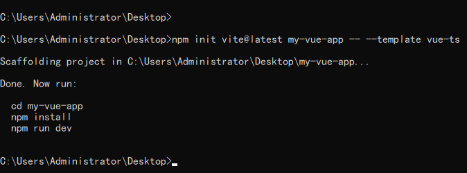
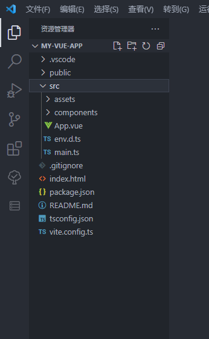
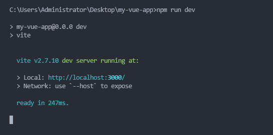
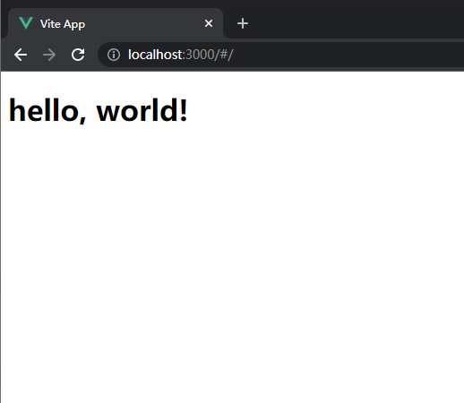
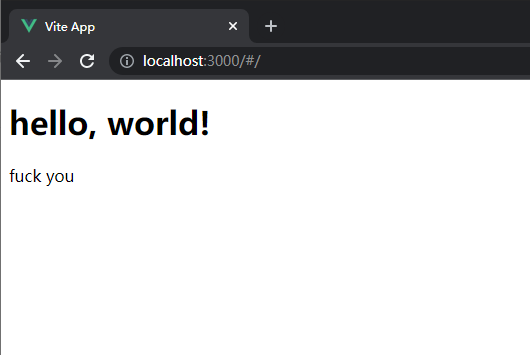
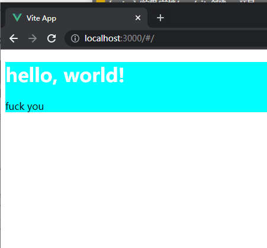

> 写作时间 2022-01-08 23:04:21

# vite创建vue项目

使用 vite 创建 vue + typescript 项目，集成 vue-router、vuex 和 sass 预处理器 。

**环境：**
- node.js 版本：v16.13.1
- npm 版本：8.1.2

## 创建项目

执行`npm init vite@latest my-vue-app -- --template vue-ts`命令创建项目




然后安装依赖
```
npm install
```


## 配置vue-router

安装vue-router
```
npm install vue-router@next -S
```
在**src**目录下新建**pages**文件夹，在**pages**下新建**index.vue**文件，内容如下：
```vue
<script lang="ts" setup>

</script>

<template>
  <div>
    <h1>hello, world!</h1>
  </div>
</template>

<style>
</style>
```


在**src**目录下新建**router**文件夹，在**router**下新建**index.ts**文件，内容如下：

```typescript
import { createRouter, createWebHashHistory} from "vue-router";

// 路由信息
const routes = [
  {
    path: '/',
    name: 'index',
    component: () => import('../pages/index.vue'),
  },
];

// 创建路由器
const router = createRouter({
  history: createWebHashHistory(),
  routes,
});

export default router;

```

在**src**下的 `main.ts` 文件中引入router
```typescript
import { createApp } from 'vue';
import App from './App.vue';
import router from './router/index';

createApp(App).use(router).mount('#app');

```

将**src**下的`app.vue`修改为以下代码
```vue
<script setup lang="ts">
</script>

<template>
<router-view></router-view>
</template>

<style>
</style>

```

执行 `npm run dev` 命令开启本地服务器，然后在浏览器打开




## 配置 vuex
安装 vuex
```
npm install vuex@next --save
```

在**src**目录下新建**store**文件夹，在**store**下新建**index.ts**文件，内容如下：

```typescript
import { createStore } from 'vuex';

export default createStore({
  state: {
    title: 'fuck you'
  },
  mutations: {
  },
  actions: {
  },
  modules: {
  }
});

```
在**src**下的 `main.ts` 文件中引入vuex
```typescript
import { createApp } from 'vue';
import App from './App.vue';
import router from './router/index';
import vuex from './store/index';

createApp(App).use(router).use(vuex).mount('#app');

```

在**pages**下的**index.vue**中使用
```
<script lang="ts" setup>
import store from '../store/index';
</script>

<template>
  <div>
    <h1>hello, world!</h1>
    {{store.state.title}}
  </div>
</template>

<style>
</style>
```

在浏览器查看效果



## 配置 sass
安装sass
```
npm install sass --save
```

然后直接修改`<style>`为 `<style lang="scss">`即可

```
# index.vue

<script lang="ts" setup>
import store from '../store/index';
</script>

<template>
  <div>
    <h1>hello, world!</h1>
    {{store.state.title}}
  </div>
</template>

<style lang="scss">
div {
  background-color: aqua;
  
  h1 {
    color: white;
  }
  
}
</style>
```


