# webpack的基本使用

当 webpack 处理应用程序时，它会递归地构建一个*依赖关系图(dependency graph)*，其中包含应用程序需要的每个模块，然后将所有这些模块打包成一个或多个 *bundle*。

Webpack 功能强大且配置项多，但只要你理解了其中的几个核心概念，就能随心应手地使用它。 Webpack 有以下几个核心概念。

- **Entry**：入口，Webpack 执行构建的第一步将从 Entry 开始，可抽象成输入。
- **Module**：模块，在 Webpack 里一切皆模块，一个模块对应着一个文件。Webpack 会从配置的 Entry 开始递归找出所有依赖的模块。
- **Chunk**：代码块，一个 Chunk 由多个模块组合而成，用于代码合并与分割。
- **Loader**：模块加载器，用于把模块原内容按照需求转换成新内容。
- **Plugin**：扩展插件，在 Webpack 构建流程中的特定时机注入扩展逻辑来改变构建结果或做你想要的事情。
- **Output**：输出结果，在 Webpack 经过一系列处理并得出最终想要的代码后输出结果。

Webpack 启动后会从 Entry 里配置的 Module 开始递归解析 Entry 依赖的所有 Module。 每找到一个 Module， 就会根据配置的 Loader 去找出对应的转换规则，对 Module 进行转换后，再解析出当前 Module 依赖的 Module。 这些模块会以 Entry 为单位进行分组，一个 Entry 和其所有依赖的 Module 被分到一个组也就是一个 Chunk。最后 Webpack 会把所有 Chunk 转换成文件输出。 在整个流程中 Webpack 会在恰当的时机执行 Plugin 里定义的逻辑。

## 安装与使用

**注意：**后面的任何环境，都是使用webpack5，以及安装相关依赖的版本，如果没有特别说明，每一个示例都是在前一个示例的基础上进行开发

### 打包js

新建一个目录，webpack_01。

```
yarn init -y
yarn add webpack webpack-cli -D
```

新建`main.js`，内容为

````javascript
console.debug('hello ,webapck5');
````

新建 `webpack.config.js`配置文件，内容：

```javascript
const path = require('path');

module.exports = {
  entry: './main.js',
  output: {
    filename: 'build.js',
    path: path.resolve(__dirname, 'dist')
  }
}
```

当前的目录结构：


执行`npx webpack`命令，会在当前路径生成 `dist `目录和 `build.js` 文件

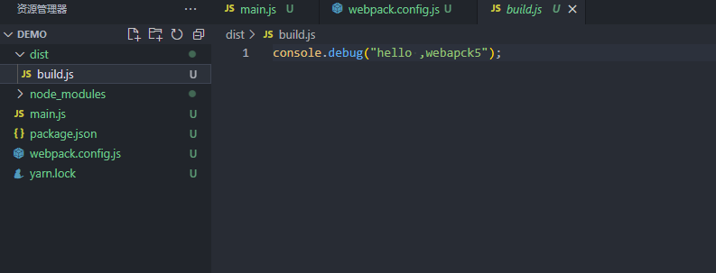

依赖版本：

```
"webpack": "^5.72.1",
"webpack-cli": "^4.9.2"
```

### 打包css

在上面的目录结构基础上添加 index.html 和 index.css 文件

index.html

```html
<!DOCTYPE html>
<html lang="en">
<head>
  <meta charset="UTF-8">
  <meta http-equiv="X-UA-Compatible" content="IE=edge">
  <meta name="viewport" content="width=device-width, initial-scale=1.0">
  <title>Document</title>
  <!-- 手动引入打包后的js文件 -->
  <script src="./dist/build.js"></script>
</head>
<body>
  
</body>
</html>
```

index.css

```css
.test {
  background-color: lightblue;
}
```

修改main.js文件为以下内容

````javascript
import './index.css';

const h1 = document.createElement('h1');
h1.textContent = 'hello ,world';
h1.className = 'test';
document.body.appendChild(h1);
````

webpack默认只能加载 js 和 json 文件，加载css文件需要使用loader机制，安装 `yarn add css-loader style-loader -D`;

修改 webpack.config.js 文件

```javascript
const path = require('path');

module.exports = {
  entry: './main.js', // 入口文件
  output: {
    filename: 'build.js', // 输出文件
    path: path.resolve(__dirname, 'dist') // 输出文件的目录
  },
  module: {
    rules: [
      {
        test: /\.css$/, // 用于匹配文件
        use: ['style-loader', 'css-loader'], // loader加载顺序，从右至左，从下往上
      }
    ]
  }
}
```

css-loader用于解析css文件，style-loader用于将css注入到style 标签里面。

npx webpack 打包后打开index.html文件

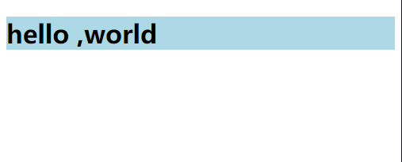

依赖版本：

```
"css-loader": "^6.7.1",
"style-loader": "^3.3.1",
"webpack": "^5.72.1",
"webpack-cli": "^4.9.2"
```

### 打包scss

`yarn add sass sass-loader -D`

新建文件 index.scss

```scss
.test {
  background: lightgreen;
  color: white;
}
```

修改 main.js

```
import './index.css';
import './index.scss';

const h1 = document.createElement('h1');
h1.textContent = 'hello ,world';
h1.className = 'test';
document.body.appendChild(h1);
```

修改webpack.config.js

````
const path = require('path');

module.exports = {
  entry: './main.js', // 入口文件
  output: {
    filename: 'build.js', // 输出文件
    path: path.resolve(__dirname, 'dist') // 输出文件的目录
  },
  module: {
    rules: [
      {
        test: /\.css$/, // 用于匹配文件
        use: ['style-loader', 'css-loader'], // loader加载顺序，从右至左，从下往上
      },
      {
        test: /\.scss$/, 
        use: ['style-loader', 'css-loader', 'sass-loader'], 
      }
    ]
  }
}
````

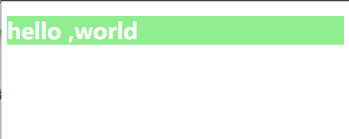

### 打包图片

webpack内置了一种资源模块(asset module)，它允许使用资源文件（字体，图标等）而无需配置额外 loader。

资源模块(asset module)是一种模块类型，它允许使用资源文件（字体，图标等）而无需配置额外 loader。

在 webpack 5 之前，通常使用：

- [`raw-loader`](https://v4.webpack.js.org/loaders/raw-loader/) 将文件导入为字符串
- [`url-loader`](https://v4.webpack.js.org/loaders/url-loader/) 将文件作为 data URI 内联到 bundle 中
- [`file-loader`](https://v4.webpack.js.org/loaders/file-loader/) 将文件发送到输出目录

资源模块类型(asset module type)，通过添加 4 种新的模块类型，来替换所有这些 loader：

- `asset/resource` 发送一个单独的文件并导出 URL。之前通过使用 `file-loader` 实现。
- `asset/inline` 导出一个资源的 data URI。之前通过使用 `url-loader` 实现。
- `asset/source` 导出资源的源代码。之前通过使用 `raw-loader` 实现。
- `asset` 在导出一个 data URI 和发送一个单独的文件之间自动选择。之前通过使用 `url-loader`，并且配置资源体积限制实现。

修改main.js 文件

```javascript
import './index.css';
import './index.scss';

import image from './bg.png'

const h1 = document.createElement('h1');
h1.textContent = 'hello ,world';
h1.className = 'test';
document.body.appendChild(h1);

const img = document.createElement('img');
img.src = image;
document.body.appendChild(img);
```

修改webpack.config.js 文件

```javascript
const path = require('path');

module.exports = {
  entry: './main.js', // 入口文件
  output: {
    filename: 'build.js', // 输出文件
    path: path.resolve(__dirname, 'dist') // 输出文件的目录
  },
  module: {
    rules: [
      {
        test: /\.css$/, // 用于匹配文件
        use: ['style-loader', 'css-loader'], // loader加载顺序，从右至左，从下往上
      },
      {
        test: /\.scss$/, 
        use: ['style-loader', 'css-loader', 'sass-loader'], 
      },
      {
        test: /\.(png|svg|jpg|jpeg|gif)$/i,
        type: 'asset/resource', // webpack5 内置的模块
      },
    ]
  }
}
```

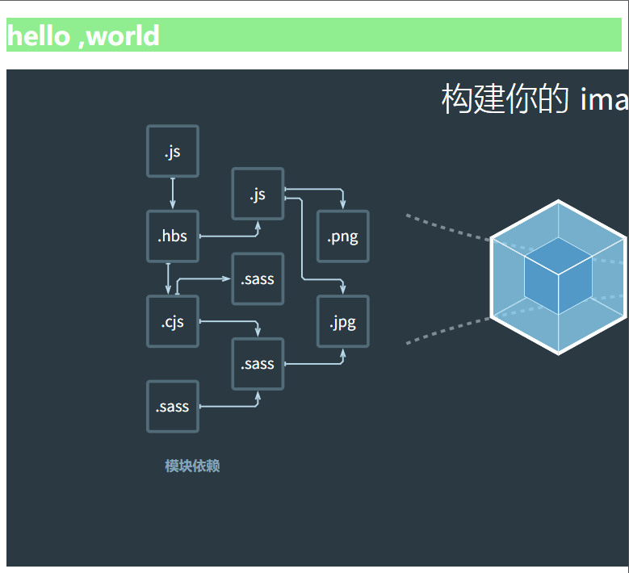

### 打包字体

修改 index.scss 文件

```scss
@font-face {
  font-family: 'myFont';
  src: url('./font.ttf');
}
.test {
  background: lightgreen;
  color: white;
  font-family: 'myFont';
}
```

修改webpack.config.js 文件

```javascript
const path = require('path');

module.exports = {
  entry: './main.js', // 入口文件
  output: {
    filename: 'build.js', // 输出文件
    path: path.resolve(__dirname, 'dist') // 输出文件的目录
  },
  module: {
    rules: [
      {
        test: /\.css$/, // 用于匹配文件
        use: ['style-loader', 'css-loader'], // loader加载顺序，从右至左，从下往上
      },
      {
        test: /\.scss$/, 
        use: ['style-loader', 'css-loader', 'sass-loader'], 
      },
      {
        test: /\.(png|svg|jpg|jpeg|gif)$/i,
        type: 'asset/resource', // webpack5 内置的模块
      },
      {
        test: /\.(woff|woff2|eot|ttf|otf)$/i,
        type: 'asset/resource'
      }
    ]
  }
}
```

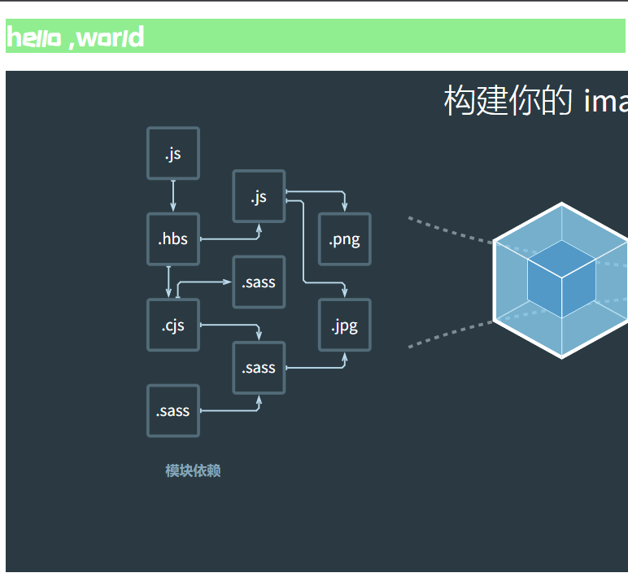

### 修改打包mode

mode为 development 时，打包后的js代码不会被压缩。

```javascript
const path = require('path');

module.exports = {
  entry: './main.js', // 入口文件
  output: {
    filename: 'build.js', // 输出文件
    path: path.resolve(__dirname, 'dist') // 输出文件的目录
  },
  module: {
    rules: [
      {
        test: /\.css$/, // 用于匹配文件
        use: ['style-loader', 'css-loader'], // loader加载顺序，从右至左，从下往上
      },
      {
        test: /\.scss$/, 
        use: ['style-loader', 'css-loader', 'sass-loader'], 
      },
      {
        test: /\.(png|svg|jpg|jpeg|gif)$/i,
        type: 'asset/resource', // webpack5 内置的模块
      },
      {
        test: /\.(woff|woff2|eot|ttf|otf)$/i,
        type: 'asset/resource'
      }
    ]
  },
  mode: 'development',
}
```

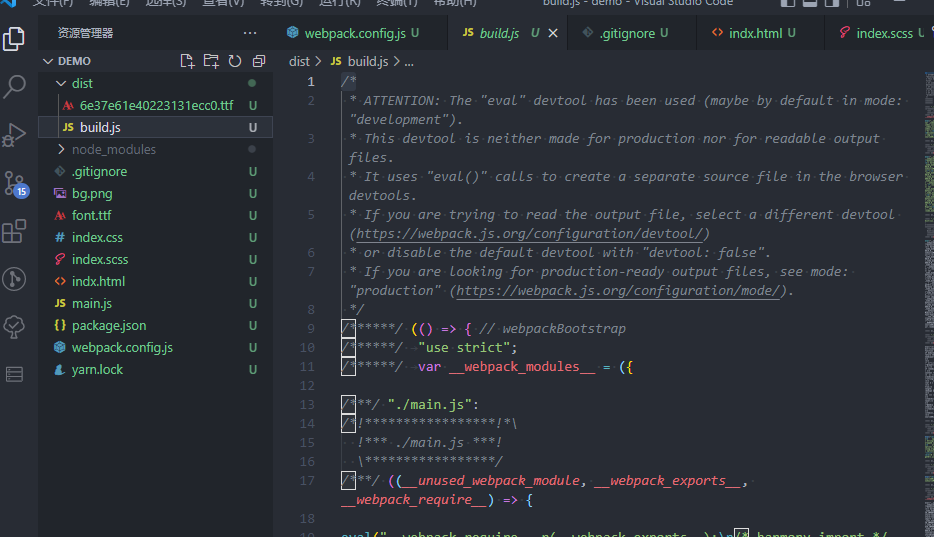

mode为 prodcution 时，打包后的js代码会被压缩，还会自动进行tree shaking。

```javascript
const path = require('path');

module.exports = {
  entry: './main.js', // 入口文件
  output: {
    filename: 'build.js', // 输出文件
    path: path.resolve(__dirname, 'dist') // 输出文件的目录
  },
  module: {
    rules: [
      {
        test: /\.css$/, // 用于匹配文件
        use: ['style-loader', 'css-loader'], // loader加载顺序，从右至左，从下往上
      },
      {
        test: /\.scss$/, 
        use: ['style-loader', 'css-loader', 'sass-loader'], 
      },
      {
        test: /\.(png|svg|jpg|jpeg|gif)$/i,
        type: 'asset/resource', // webpack5 内置的模块
      },
      {
        test: /\.(woff|woff2|eot|ttf|otf)$/i,
        type: 'asset/resource'
      }
    ]
  },
  mode: 'production',
}
```

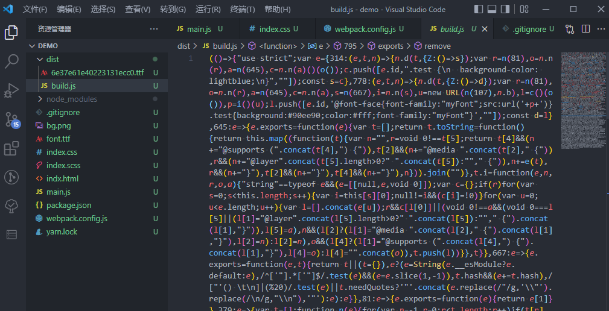

### 将css提取到一个单独的文件中

使用 mini-css-extract-plugin 插件

`yarn add  mini-css-extract-plugin -D`

修改 index.html

```html
<!DOCTYPE html>
<html lang="en">
<meta charset="UTF-8">
<meta http-equiv="X-UA-Compatible" content="IE=edge">
<meta name="viewport" content="width=device-width, initial-scale=1.0">
<title>Document</title>
<!-- 手动引入打包后的css文件 -->
<link href="./dist/build.css" rel="stylesheet" type="text/css" />
</head>
<!-- 手动引入打包后的js文件 -->
<script src="./dist/build.js" defer></script>
<body>

</body>

</html>
```

修改 webpack.config.js 

```javascript
const path = require('path');
const MiniCssExtractPlugin = require("mini-css-extract-plugin");

module.exports = {
  entry: './main.js', // 入口文件
  output: {
    filename: 'build.js', // 输出文件
    path: path.resolve(__dirname, 'dist') // 输出文件的目录
  },
  module: {
    rules: [
      {
        test: /\.css$/, // 用于匹配文件
        use: [MiniCssExtractPlugin.loader, 'css-loader'], // loader加载顺序，从右至左，从下往上
      },
      {
        test: /\.scss$/,
        use: [MiniCssExtractPlugin.loader, 'css-loader', 'sass-loader'],
      },
      {
        test: /\.(png|svg|jpg|jpeg|gif)$/i,
        type: 'asset/resource', // webpack5 内置的模块
      },
      {
        test: /\.(woff|woff2|eot|ttf|otf)$/i,
        type: 'asset/resource'
      }
    ]
  },
  mode: 'development',
  plugins: [
    new MiniCssExtractPlugin({
      filename: 'build.css'
    })
  ]
}
```

npx webpack 编译后

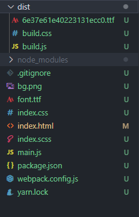

运行效果

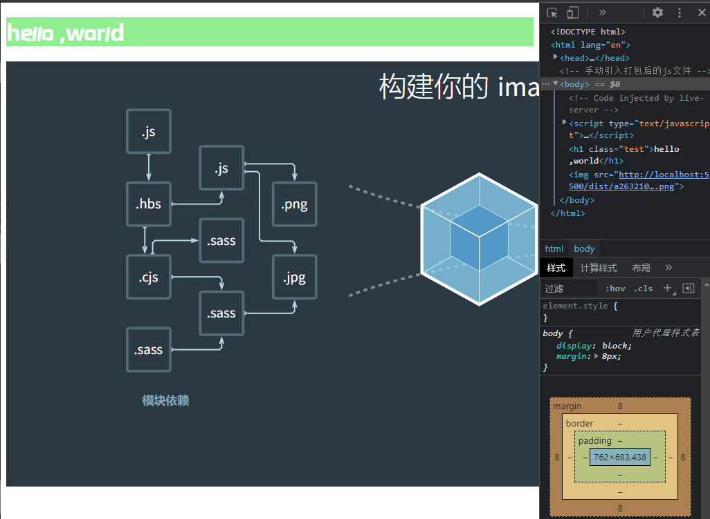

### 生成html文件，自动引入依赖

使用 html-webpack-plugin 插件

`yarn add html-webpack-plugin -D`

修改 webpack.config.js

```javascript
const path = require('path');
const MiniCssExtractPlugin = require("mini-css-extract-plugin");
const HtmlWebpackPlugin = require('html-webpack-plugin');

module.exports = {
  entry: './main.js', // 入口文件
  output: {
    filename: 'build.js', // 输出文件
    path: path.resolve(__dirname, 'dist') // 输出文件的目录
  },
  module: {
    rules: [
      {
        test: /\.css$/, // 用于匹配文件
        use: [MiniCssExtractPlugin.loader, 'css-loader'], // loader加载顺序，从右至左，从下往上
      },
      {
        test: /\.scss$/,
        use: [MiniCssExtractPlugin.loader, 'css-loader', 'sass-loader'],
      },
      {
        test: /\.(png|svg|jpg|jpeg|gif)$/i,
        type: 'asset/resource', // webpack5 内置的模块
      },
      {
        test: /\.(woff|woff2|eot|ttf|otf)$/i,
        type: 'asset/resource'
      }
    ]
  },
  mode: 'development',
  plugins: [
    new MiniCssExtractPlugin({
      filename: 'build.css'
    }),
    new HtmlWebpackPlugin(
      {
        title: 'HtmlWebpackPlugin', // 网页的标题
        minify: false, // 是否压缩
      }
    ),
  ]
}
```

npx webpack

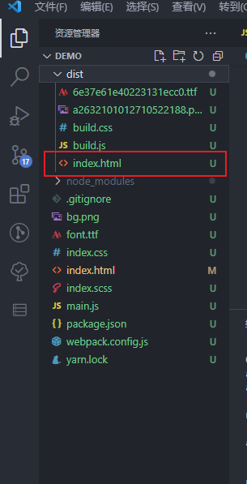

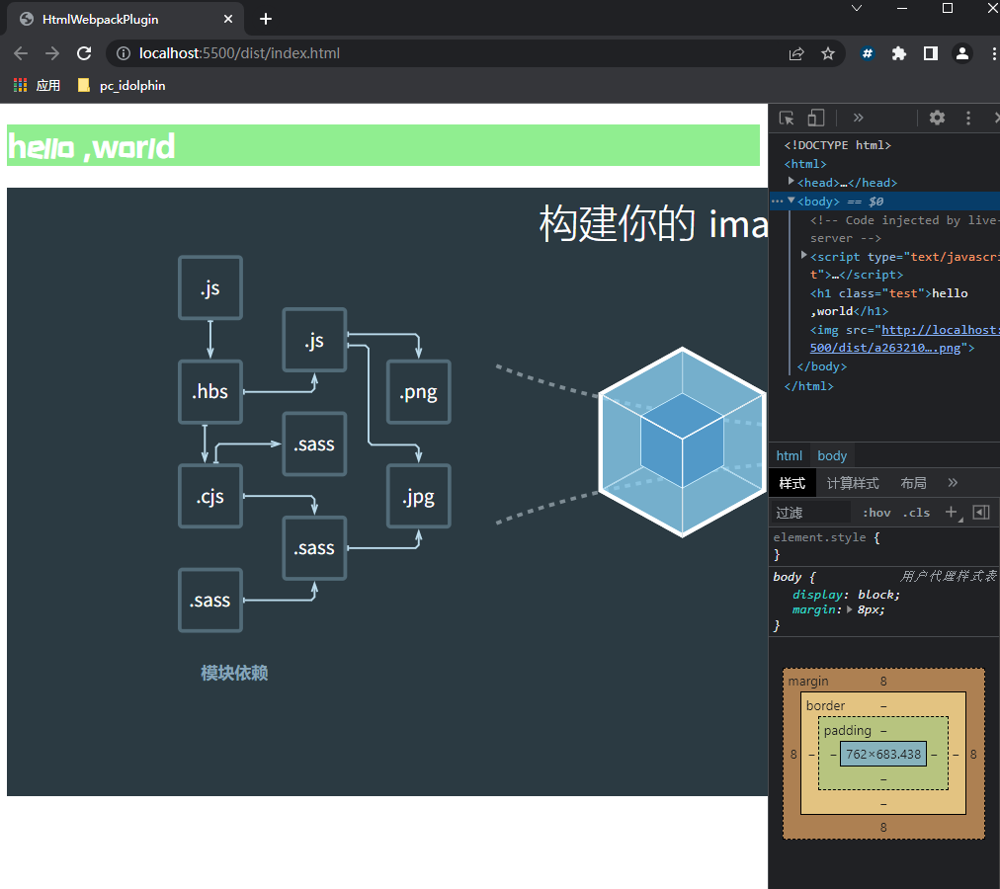

### 自动删除打包目录

每次打包时，自动删除上次打包产生的 dist 目录。

在webpack5之前，需要使用`clean-webpack-plugin`插件，webpack5内置了该功能，只需要配置 `output.clean = true`即可。

修改webpack.config.js 

```javascript
const path = require('path');
const MiniCssExtractPlugin = require("mini-css-extract-plugin");
const HtmlWebpackPlugin = require('html-webpack-plugin');

module.exports = {
  entry: './main.js', // 入口文件
  output: {
    filename: 'build.js', // 输出文件
    path: path.resolve(__dirname, 'dist'), // 输出文件的目录
    clean: true,
  },
  module: {
    rules: [
      {
        test: /\.css$/, // 用于匹配文件
        use: [MiniCssExtractPlugin.loader, 'css-loader'], // loader加载顺序，从右至左，从下往上
      },
      {
        test: /\.scss$/,
        use: [MiniCssExtractPlugin.loader, 'css-loader', 'sass-loader'],
      },
      {
        test: /\.(png|svg|jpg|jpeg|gif)$/i,
        type: 'asset/resource', // webpack5 内置的模块
      },
      {
        test: /\.(woff|woff2|eot|ttf|otf)$/i,
        type: 'asset/resource'
      }
    ]
  },
  mode: 'development',
  plugins: [
    new MiniCssExtractPlugin({
      filename: 'build.css'
    }),
    new HtmlWebpackPlugin(
      {
        title: 'HtmlWebpackPlugin', // 网页的标题
        minify: true, // 是否压缩
      }
    ),
  ]
}
```

### 配置生成source map（源码映射）

从我们开发写的代码，到浏览器能运行的代码，代码被经过压缩和转换，如果代码中出现了错误，排错和调式变得很困难。

source mpa就是源码映射，它可以单独的一个文件，也可以内置在打包后的代码里面，它里面储存着位置信息，记录着转换后的代码的每一个位置，所对应的转换前的位置。

有了它，出错的时候，除错工具将直接显示原始代码，而不是转换后的代码。这无疑给开发者带来了很大方便。

webpack的 devtool配置选项用于配置如何生成 source map。

修改 main.js

```javascript
import './index.css';
import './index.scss';

import image from './bg.png'

const h1 = document.createElement('h1');
h1.textContent = 'hello ,world';
h1.className = 'test';
document.body.appendChild(h1);

const img = document.createElement('img');
img.src = image;
document.body.appendChild(img);


// 故意打错
console.deg('hhlo')
```

不配置 devtool 

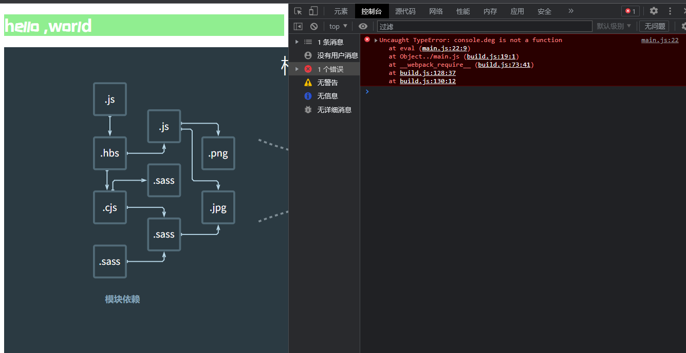

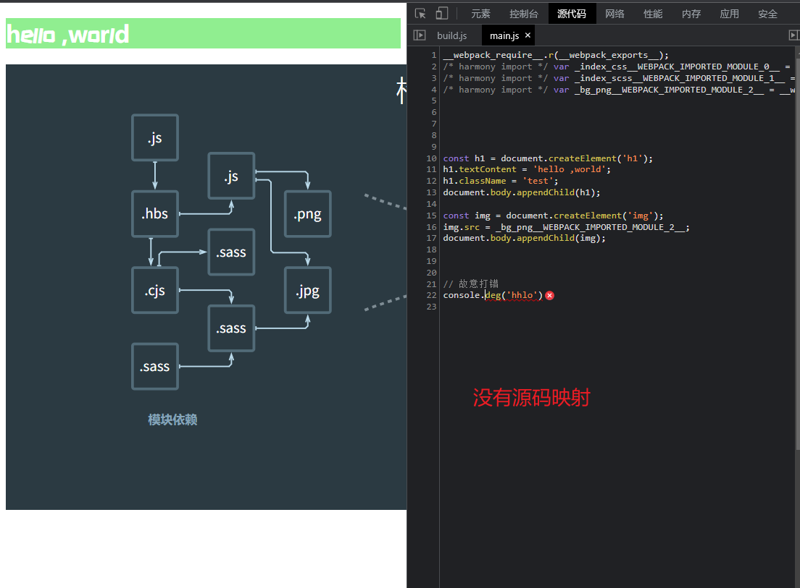

修改 webpack.config.js

```javascript
const path = require('path');
const MiniCssExtractPlugin = require("mini-css-extract-plugin");
const HtmlWebpackPlugin = require('html-webpack-plugin');

module.exports = {
  entry: './main.js', // 入口文件
  output: {
    filename: 'build.js', // 输出文件
    path: path.resolve(__dirname, 'dist'), // 输出文件的目录
    clean: true,
  },
  module: {
    rules: [
      {
        test: /\.css$/, // 用于匹配文件
        use: [MiniCssExtractPlugin.loader, 'css-loader'], // loader加载顺序，从右至左，从下往上
      },
      {
        test: /\.scss$/,
        use: [MiniCssExtractPlugin.loader, 'css-loader', 'sass-loader'],
      },
      {
        test: /\.(png|svg|jpg|jpeg|gif)$/i,
        type: 'asset/resource', // webpack5 内置的模块
      },
      {
        test: /\.(woff|woff2|eot|ttf|otf)$/i,
        type: 'asset/resource'
      }
    ]
  },
  mode: 'development',
  plugins: [
    new MiniCssExtractPlugin({
      filename: 'build.css'
    }),
    new HtmlWebpackPlugin(
      {
        title: 'HtmlWebpackPlugin', // 网页的标题
        minify: true, // 是否压缩
      }
    ),
  ],
  devtool: 'inline-source-map'
}
```


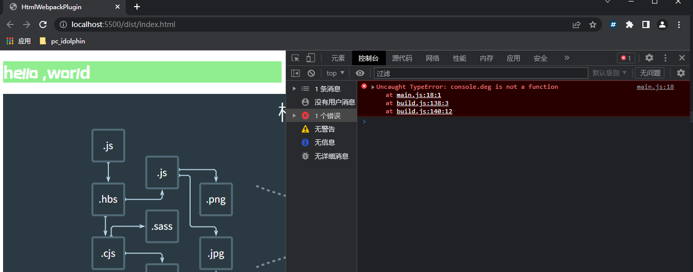

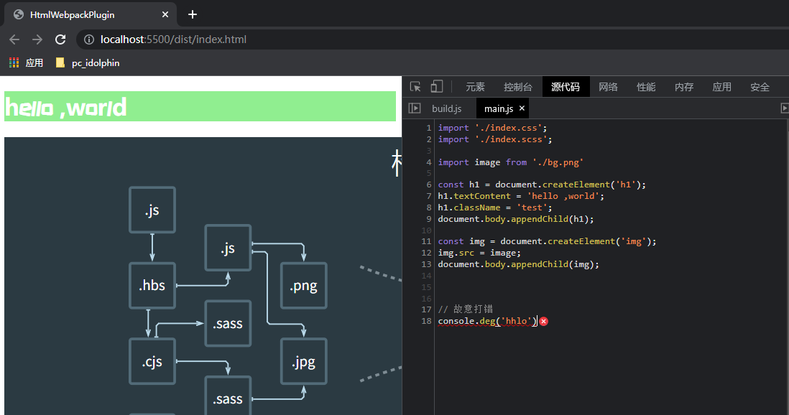

### 使用babel 转换成 es5

Babel是一个前端工具，是一个javascript 编译器，用于将 ES6+ 代码转换为 JavaScript 向后兼容版本的代码。

不是所有的浏览器支持 ES6+ 的语法和新特性，所以为了兼容需要使用babel来转换。

#### 使用插件

babel将语法转换的规则体现为插件的形式，插件指示bale如何进行代码转换。如果要将 es6 的箭头函数 转为 普通 函数，可以使用`@babel/plugin-transform-arrow-functions`插件

````
yarn babel-loader @babel/plugin-transform-arrow-functions -D
````

`@babel/core`是babel的核心，`babel-loader`内部调用`@babel/core`，应用 `@babel/plugin-transform-arrow-functions`语法转换规则来处理 js。

新建 `.browserlistrc`文件，用来告诉 babel 需要兼容的浏览器

```
# 注释是这样写的，以#号开头

> 1% #代表全球超过1%使用的浏览器
last 2 versions # 最新的 2 个主版本
not ie <= 8 #不包含 IE8 及更低的版本

```

新建 `babel.config.js`文件

````javascrit
module.exports = {
  plugins: [ // 配置插件
    ['@babel/plugin-transform-arrow-functions']
  ]
}
````

修改 webpack.config.js

```javascript
const path = require('path');
const MiniCssExtractPlugin = require("mini-css-extract-plugin");
const HtmlWebpackPlugin = require('html-webpack-plugin');

module.exports = {
  entry: './main.js', // 入口文件
  output: {
    filename: 'build.js', // 输出文件
    path: path.resolve(__dirname, 'dist'), // 输出文件的目录
    clean: true,
  },
  module: {
    rules: [
      {
        test: /\.css$/, // 用于匹配文件
        use: [MiniCssExtractPlugin.loader, 'css-loader'], // loader加载顺序，从右至左，从下往上
      },
      {
        test: /\.scss$/,
        use: [MiniCssExtractPlugin.loader, 'css-loader', 'sass-loader'],
      },
      {
        test: /\.(png|svg|jpg|jpeg|gif)$/i,
        type: 'asset/resource', // webpack5 内置的模块
      },
      {
        test: /\.(woff|woff2|eot|ttf|otf)$/i,
        type: 'asset/resource'
      },
      {
        test: /\.js$/,
        exclude: /node_modules/,
        use: ['babel-loader']
      }
    ]
  },
  mode: 'development',
  plugins: [
    new MiniCssExtractPlugin({
      filename: 'build.css'
    }),
    new HtmlWebpackPlugin(
      {
        title: 'HtmlWebpackPlugin', // 网页的标题
        minify: true, // 是否压缩
      }
    ),
  ],
  devtool: 'inline-source-map'
}
```

修改 main.js

```javascript
const print = () => {
  console.debug('print')
}
```

编译运行，查看 build.js 文件

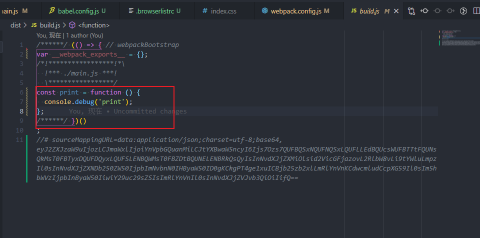

每转换一种语法都要添加配置一个语法转换规则插件，例如块作用域 和 calss

```
yarn add @babel/plugin-transform-block-scoping @babel/plugin-transform-classes -D
```

修改 bebel.config.js

```javascript
module.exports = {
  plugins: [ // 配置插件
    ['@babel/plugin-transform-arrow-functions'],
    ['@babel/plugin-transform-block-scoping'],
    ['@babel/plugin-transform-classes']
  ]
}
```

修改 main.js

```javascript
const print = () => {
  console.debug('print')
}

const a = 'a'

class Person {

}
```

编译后，build.js 的结果

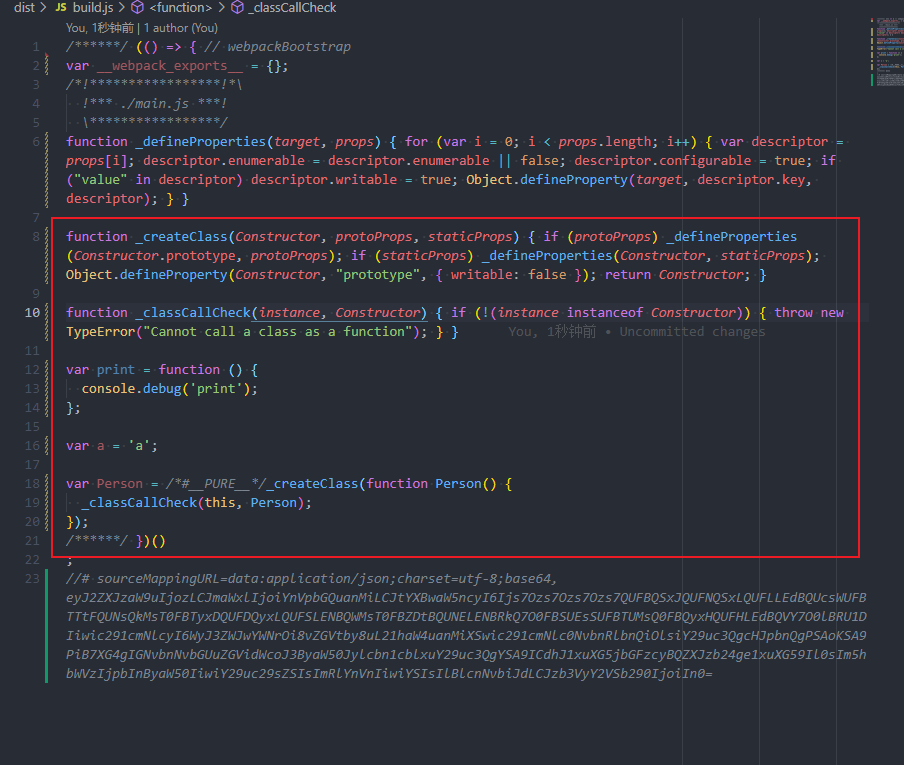

#### 使用预设

每需要转换一个语法，都需要安装和配置一个插件，很繁琐，babel提供了preset（预设），一个预设包含着一组预先设定的插件。

使用 `@babel/preset-env`可以代替配置多个插件。

`yarn add @babel/preset-env -D`

修改 babel.config.js

```javascript
module.exports = {
  presets: [
    ['@babel/preset-env']
  ]
}
```

编译查看 build.js 

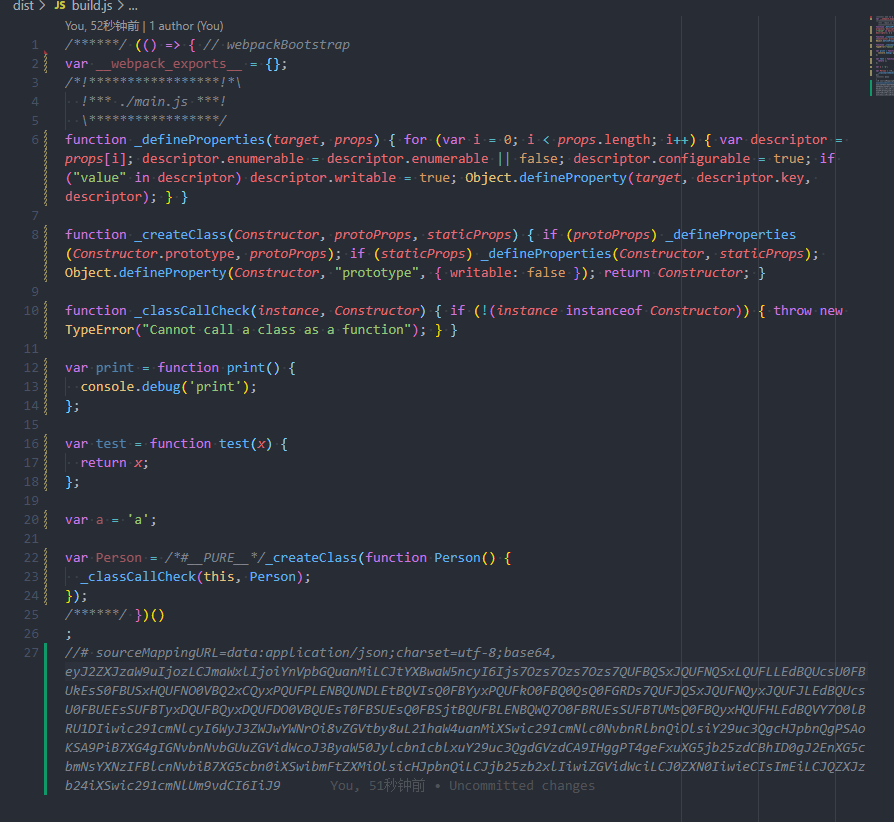

#### 使用polyfill

以上的配置只能转换新语法，如果想要使用 promise 新特性需要引入 polyfill，polyfill是一个概念，指的是填充，填充新特性。

```
yarn add @babel/polyfill -S
```

修改 `main.js`

```javascript
import "@babel/polyfill";

const p = new Promise((resolve, reject) => {
  console.debug('promise')
})

const print = () => {
  console.debug('print')
}

const test = x => x

const a = 'a'

class Person {

}
```

编译运行

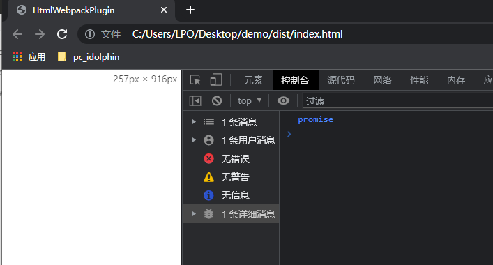

#### 使用 `@babel/preset-env`内置的polyfill

`@babel/polyfill`在 babel7 被废弃了，`@babel/preset-env`内置了polyfill，只要使用预设的时候传递options即可启用`@babel/preset-env`内置的polyfill

修改 main.js

```javascript
const p = new Promise((resolve, reject) => {
  console.debug('promise')
})

const print = () => {
  console.debug('print')
}

const test = x => x

const a = 'a'

class Person {

}
```

修改 bebel.config.js

```javascript
module.exports = {
  presets: [
    ['@babel/preset-env', {
      useBuiltIns: 'usage',
      corejs: 2,
    }]
  ]
}
```

即可实现polyfill。

### 使用PostCSS 转换 CSS

**PostCSS**是一个用 JavaScript 工具和插件转换 CSS 代码的工具

#### 使用插件

使用 `autoprefixer`插件为CSS 添加浏览器前缀

```
yarn add autoprefixer postcss-loader -D
```

新建 postcss.config.js

```javascript
module.exports = {
  plugins: [
    require('autoprefixer'),
  ]
}
```

修改 main.js

```javascript
import './index.css';
import './index.scss';

import image from './bg.png'

const h1 = document.createElement('h1');
h1.textContent = 'hello ,world';
h1.className = 'test';
document.body.appendChild(h1);

const img = document.createElement('img');
img.src = image;
document.body.appendChild(img);
```

修改 index.scss

```scss
@font-face {
  font-family: 'myFont';
  src: url('./font.ttf');
}
.test {
  background: lightgreen;
  color: white;
  font-family: 'myFont';
  display: flex;
}
```

修改 webpack.config.js，使用`postcss-loader`

```javascript
const path = require('path');
const MiniCssExtractPlugin = require("mini-css-extract-plugin");
const HtmlWebpackPlugin = require('html-webpack-plugin');

module.exports = {
  entry: './main.js', // 入口文件
  output: {
    filename: 'build.js', // 输出文件
    path: path.resolve(__dirname, 'dist'), // 输出文件的目录
    clean: true,
  },
  module: {
    rules: [
      {
        test: /\.css$/, // 用于匹配文件
        use: [MiniCssExtractPlugin.loader, 'css-loader', 'postcss-loader'], // loader加载顺序，从右至左，从下往上
      },
      {
        test: /\.scss$/,
        use: [MiniCssExtractPlugin.loader, 'css-loader',  'postcss-loader', 'sass-loader'],
      },
      {
        test: /\.(png|svg|jpg|jpeg|gif)$/i,
        type: 'asset/resource', // webpack5 内置的模块
      },
      {
        test: /\.(woff|woff2|eot|ttf|otf)$/i,
        type: 'asset/resource'
      },
      {
        test: /\.js$/,
        exclude: /node_modules/,
        use: ['babel-loader']
      }
    ]
  },
  mode: 'development',
  plugins: [
    new MiniCssExtractPlugin({
      filename: 'build.css'
    }),
    new HtmlWebpackPlugin(
      {
        title: 'HtmlWebpackPlugin', // 网页的标题
        minify: true, // 是否压缩
      }
    ),
  ],
  devtool: 'inline-source-map'
}
```

编译查看效果


#### 使用预设

`postcss-preset-env`允许使用未来的CSS特性，包括 autoprefixer

预设的概念是，预设包括了一些插件，在postcss配置中，插件的预设的使用方式是一样的

```
yarn add postcss-preset-env -D
```

修改 index.scss

```scss
@font-face {
  font-family: 'myFont';
  src: url('./font.ttf');
}
.test {
  background: #12345613; // 使用css3最新特性，8位十六进制，后面2位代表透明度
  color: white;
  font-family: 'myFont';
  display: flex;
}
```

修改 postcss.config.js

```javascript
module.exports = {
  plugins: [
    require('postcss-preset-env'),
  ]
}
```

编译查看效果

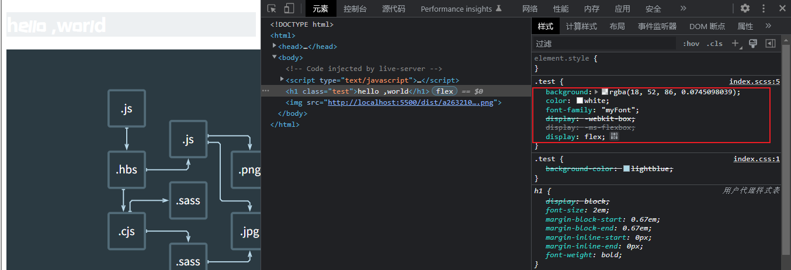

### 使用watch选项监听修改自动编译

启用 watch 模式，webpack会监听整个项目的文件，任何文件改动，webpack都会自动编译打包生成 dist 文件夹。

修改 webpack.config.js

```javascript
const path = require('path');
const MiniCssExtractPlugin = require("mini-css-extract-plugin");
const HtmlWebpackPlugin = require('html-webpack-plugin');

module.exports = {
  entry: './main.js', // 入口文件
  output: {
    filename: 'build.js', // 输出文件
    path: path.resolve(__dirname, 'dist'), // 输出文件的目录
    clean: true,
  },
  module: {
    rules: [
      {
        test: /\.css$/, // 用于匹配文件
        use: [MiniCssExtractPlugin.loader, 'css-loader', 'postcss-loader'], // loader加载顺序，从右至左，从下往上
      },
      {
        test: /\.scss$/,
        use: [MiniCssExtractPlugin.loader, 'css-loader',  'postcss-loader', 'sass-loader'],
      },
      {
        test: /\.(png|svg|jpg|jpeg|gif)$/i,
        type: 'asset/resource', // webpack5 内置的模块
      },
      {
        test: /\.(woff|woff2|eot|ttf|otf)$/i,
        type: 'asset/resource'
      },
      {
        test: /\.js$/,
        exclude: /node_modules/,
        use: ['babel-loader']
      }
    ]
  },
  mode: 'development',
  plugins: [
    new MiniCssExtractPlugin({
      filename: 'build.css'
    }),
    new HtmlWebpackPlugin(
      {
        title: 'HtmlWebpackPlugin', // 网页的标题
        minify: true, // 是否压缩
      }
    ),
  ],
  devtool: 'inline-source-map',
  watch: true, // 开启 watch 模式
}
```

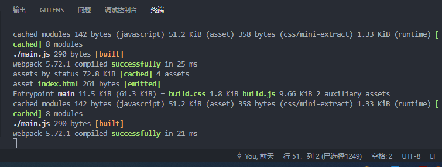

### 使用 webpack-dev-server

`webpack-dev-server` 为你提供了一个基本的 web server，并且具有实时预览功能。设置如下：

- 开启一个服务器用于开发
- 监听变化自动编译和刷新浏览器预览
- 编译的文件存放于内存，速度较快

`webpack-dev-server` 默认的刷新机制是热重载。

- 热重载 ： 顾名思义重新加载，使用 `window.location.reload()` 刷新界面以达到更新的目的
- 热更新：只更新修改的文件。不会刷新界面。

使用`webpack-dev-server` 需要关闭 watch 模式。

````
yarn add webpack-dev-server -D
````

修改 webpack.config.js

```javascript
const path = require('path');
const MiniCssExtractPlugin = require("mini-css-extract-plugin");
const HtmlWebpackPlugin = require('html-webpack-plugin');

module.exports = {
  entry: './main.js', // 入口文件
  output: {
    filename: 'build.js', // 输出文件
    path: path.resolve(__dirname, 'dist'), // 输出文件的目录
    clean: true,
  },
  module: {
    rules: [
      {
        test: /\.css$/, // 用于匹配文件
        use: [MiniCssExtractPlugin.loader, 'css-loader', 'postcss-loader'], // loader加载顺序，从右至左，从下往上
      },
      {
        test: /\.scss$/,
        use: [MiniCssExtractPlugin.loader, 'css-loader',  'postcss-loader', 'sass-loader'],
      },
      {
        test: /\.(png|svg|jpg|jpeg|gif)$/i,
        type: 'asset/resource', // webpack5 内置的模块
      },
      {
        test: /\.(woff|woff2|eot|ttf|otf)$/i,
        type: 'asset/resource'
      },
      {
        test: /\.js$/,
        exclude: /node_modules/,
        use: ['babel-loader']
      }
    ]
  },
  mode: 'development',
  plugins: [
    new MiniCssExtractPlugin({
      filename: 'build.css'
    }),
    new HtmlWebpackPlugin(
      {
        title: 'HtmlWebpackPlugin', // 网页的标题
        minify: true, // 是否压缩
      }
    ),
  ],
  devtool: 'inline-source-map',
  watch: false, // 关闭 watch 模式
  devServer: { // 配置 dev server
    static: './dist' // 将dist目录下的文件服务到localhost:8080 下
  }
}
```

执行`npx webpack serve`开启 dev server

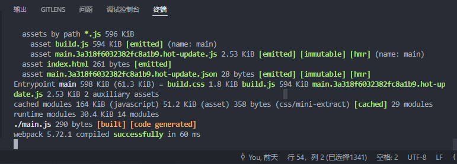

#### 热更新

`style-loader`，在幕后使用了`module.hot.accept`来热更新css。

而 js 文件 需要我们在入口文件`main.ts`手动添加`module.hot.accept`来实现热更新

新建一个文件`test.js`

```javascript
console.log('1111')
```

修改 `main.js`

```javascript
import './index.css';
import './index.scss';

import image from './bg.png'

import './test.js'

const h1 = document.createElement('h1');
h1.textContent = 'hello ,world';
h1.className = 'test';
document.body.appendChild(h1);

const img = document.createElement('img');
img.src = image;
document.body.appendChild(img);

if (module.hot) {
  // 需要进行热更新替换的模块要在这里配置
  module.hot.accept('./test.js', function() {
    console.log('正在热更新替换模块');
  })
}
```

`npx webpack serve`启动dev server

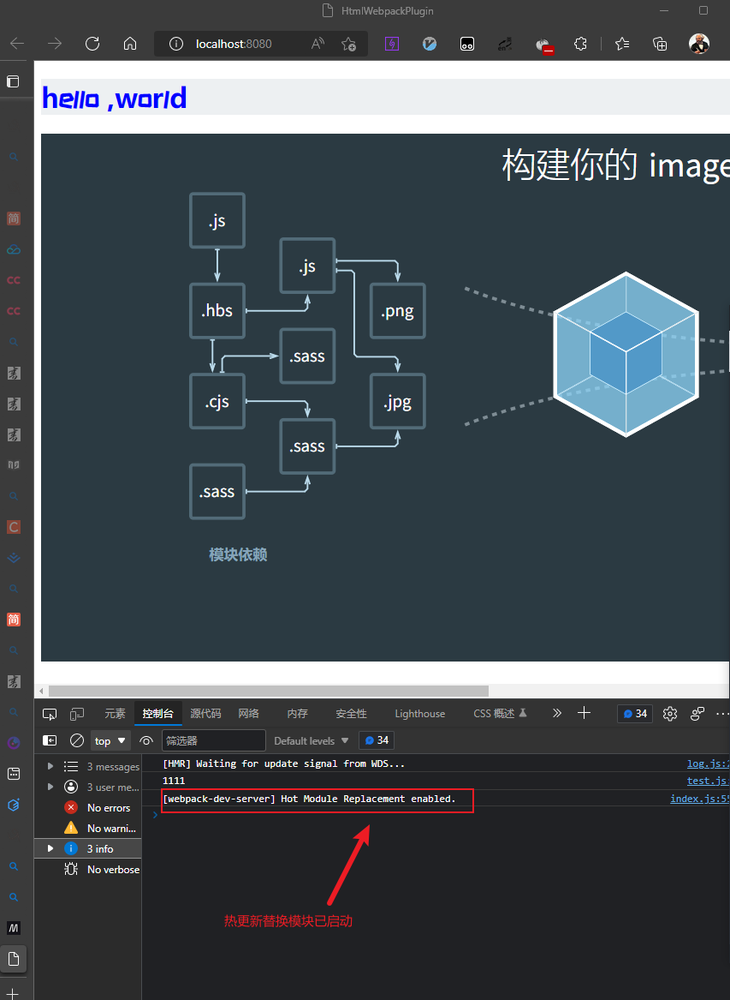

修改`test.js`

```javascript
console.log('2222')
```

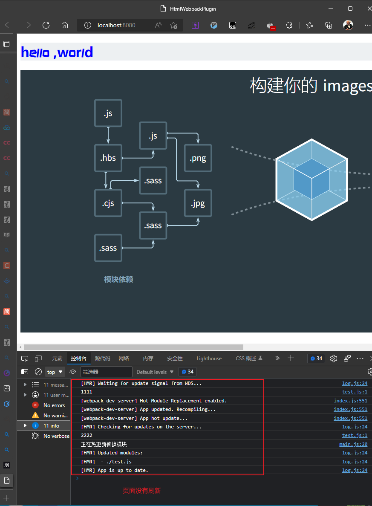

### 配置模块解析规则

#### 路径解析

在导入模块的时候，不添加后缀名时，可以配置webpack的模块解析规则。

修改 `main.js`

```javascript
import './index.css';
import './index.scss';

import image from './bg.png'

import './test'; // 不带后缀

const h1 = document.createElement('h1');
h1.textContent = 'hello ,world';
h1.className = 'test';
document.body.appendChild(h1);

const img = document.createElement('img');
img.src = image;
document.body.appendChild(img);

if (module.hot) {
  // 需要进行热更新替换的模块要在这里配置
  module.hot.accept('./test.js', function() {
    console.log('正在热更新替换模块');
  })
}
```

修改 `test.js`

```javascript
console.log('我被导入时没有写完扩展名')
```

修改 `webpack.config.js`

```javascript
const path = require('path');
const MiniCssExtractPlugin = require("mini-css-extract-plugin");
const HtmlWebpackPlugin = require('html-webpack-plugin');

module.exports = {
  entry: './main.js', // 入口文件
  output: {
    filename: 'build.js', // 输出文件
    path: path.resolve(__dirname, 'dist'), // 输出文件的目录
    clean: true,
  },
  module: {
    rules: [
      {
        test: /\.css$/, // 用于匹配文件
        use: [MiniCssExtractPlugin.loader, 'css-loader', 'postcss-loader'], // loader加载顺序，从右至左，从下往上
      },
      {
        test: /\.scss$/,
        use: [MiniCssExtractPlugin.loader, 'css-loader',  'postcss-loader', 'sass-loader'],
      },
      {
        test: /\.(png|svg|jpg|jpeg|gif)$/i,
        type: 'asset/resource', // webpack5 内置的模块
      },
      {
        test: /\.(woff|woff2|eot|ttf|otf)$/i,
        type: 'asset/resource'
      },
      {
        test: /\.js$/,
        exclude: /node_modules/,
        use: ['babel-loader']
      }
    ]
  },
  mode: 'development',
  plugins: [
    new MiniCssExtractPlugin({
      filename: 'build.css'
    }),
    new HtmlWebpackPlugin(
      {
        title: 'HtmlWebpackPlugin', // 网页的标题
        minify: true, // 是否压缩
      }
    ),
  ],
  devtool: 'inline-source-map',
  watch: false, // 关闭 watch 模式
  devServer: { // 配置 dev server
    static: './dist', // 将dist目录下的文件服务到localhost:8080 下
    hot: true,
    liveReload: false,
  },
  resolve: {
    extensions: ['.js', '.json'], // 按照优先级，匹配不带后缀模块
  }
}
```

`npx webpack serve`

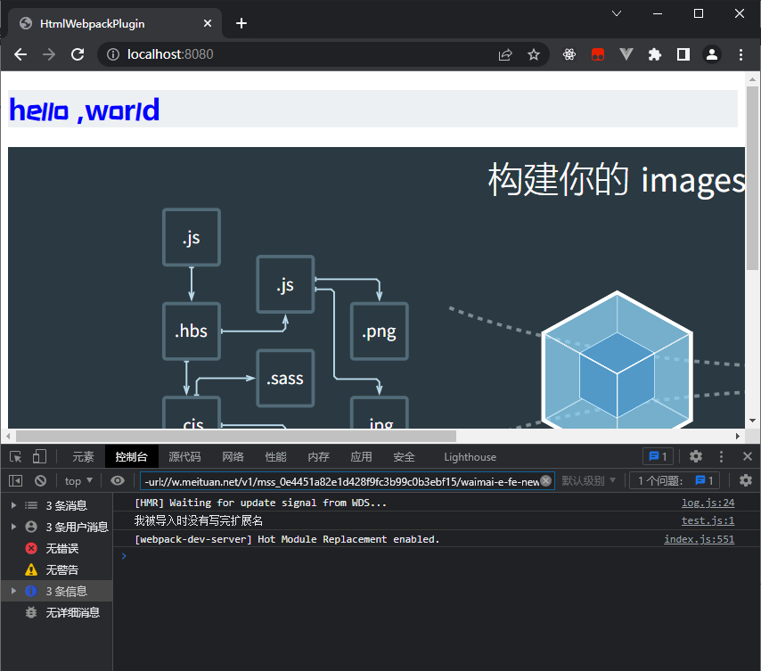

#### 配置路径别名

在导入模块的时候，可以配置别名来代替实际的真是路径

新建`src`目录，然后将`test.js`移入`src`目录

修改`main.js`

```javascript
import './index.css';
import './index.scss';

import image from './bg.png'

import '@/test'; // 使用别名

const h1 = document.createElement('h1');
h1.textContent = 'hello ,world';
h1.className = 'test';
document.body.appendChild(h1);

const img = document.createElement('img');
img.src = image;
document.body.appendChild(img);

if (module.hot) {
  // 需要进行热更新替换的模块要在这里配置
  module.hot.accept('@/test.js', function() {
    console.log('正在热更新替换模块');
  })
}
```

修改 `webpack.config.js`

```javascript
const path = require('path');
const MiniCssExtractPlugin = require("mini-css-extract-plugin");
const HtmlWebpackPlugin = require('html-webpack-plugin');

module.exports = {
  entry: './main.js', // 入口文件
  output: {
    filename: 'build.js', // 输出文件
    path: path.resolve(__dirname, 'dist'), // 输出文件的目录
    clean: true,
  },
  module: {
    rules: [
      {
        test: /\.css$/, // 用于匹配文件
        use: [MiniCssExtractPlugin.loader, 'css-loader', 'postcss-loader'], // loader加载顺序，从右至左，从下往上
      },
      {
        test: /\.scss$/,
        use: [MiniCssExtractPlugin.loader, 'css-loader',  'postcss-loader', 'sass-loader'],
      },
      {
        test: /\.(png|svg|jpg|jpeg|gif)$/i,
        type: 'asset/resource', // webpack5 内置的模块
      },
      {
        test: /\.(woff|woff2|eot|ttf|otf)$/i,
        type: 'asset/resource'
      },
      {
        test: /\.js$/,
        exclude: /node_modules/,
        use: ['babel-loader']
      }
    ]
  },
  mode: 'development',
  plugins: [
    new MiniCssExtractPlugin({
      filename: 'build.css'
    }),
    new HtmlWebpackPlugin(
      {
        title: 'HtmlWebpackPlugin', // 网页的标题
        minify: true, // 是否压缩
      }
    ),
  ],
  devtool: 'inline-source-map',
  watch: false, // 关闭 watch 模式
  devServer: { // 配置 dev server
    static: './dist', // 将dist目录下的文件服务到localhost:8080 下
    hot: true,
    liveReload: false,
  },
  resolve: {
    extensions: ['.js', '.json'], // 按照优先级，匹配不带后缀模块
    alias: {
      '@': path.resolve(__dirname, 'src'),
    }
  }
}
```

`npx webpack serve`

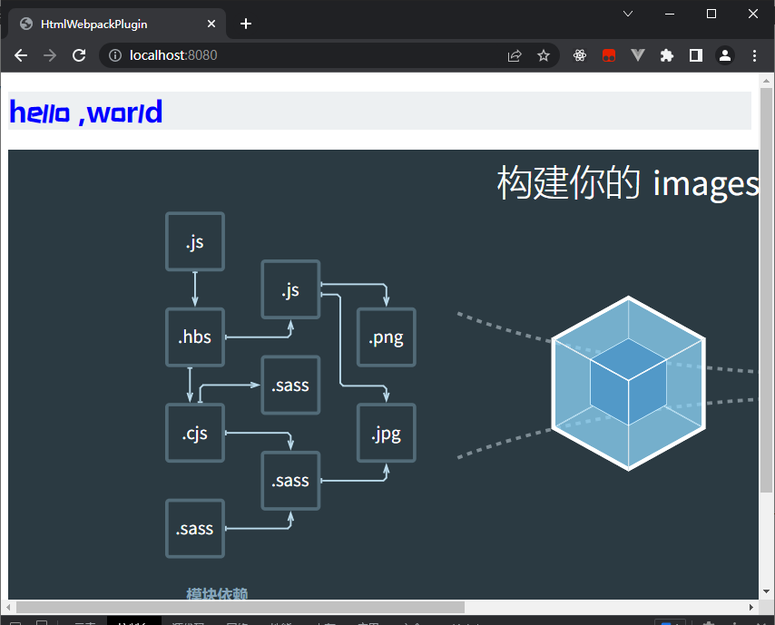

### 使用代理

在开发阶段可以配置代理服务来解决跨域问题

#### 开启代理

在本地模拟请求的话，使用koa2框架即可。

`yarn add koa @koa/router -S`

新建`koa.js`

````javascript
const Koa = require('koa');
const Router = require('@koa/router');
const koa = new Koa();


const router = new Router();
router.get('/api', (ctx) => {
  ctx.body = '你正在访问api'
})

koa.use(router.routes())
// 设置端口为1234，跟网页的不一样就可以形成跨域问题
koa.listen(1234, () => {
  console.log('server is running on http://localhost:1234')
})
````

`yarn add axios -S`

前端用`axios`来发请求

修改`./src/test.js`

```javascript
import Axios from 'axios';

Axios.get('http://localhost:1234/api').then(res => {
  console.debug(res)
})
```

`npx webpack serve`

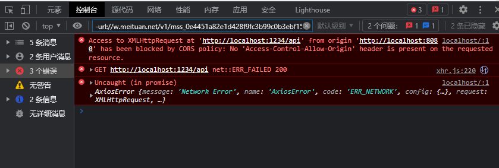

修改`./src/test.js`

```javascript
import Axios from 'axios';

// 代理会替换这个域名的
Axios.get('http://localhost:8080/api').then(res => {
  console.debug(res)
})
```

修改 `webpack.config.js`

```javascript
const path = require('path');
const MiniCssExtractPlugin = require("mini-css-extract-plugin");
const HtmlWebpackPlugin = require('html-webpack-plugin');

module.exports = {
  entry: './main.js', // 入口文件
  output: {
    filename: 'build.js', // 输出文件
    path: path.resolve(__dirname, 'dist'), // 输出文件的目录
    clean: true,
  },
  module: {
    rules: [
      {
        test: /\.css$/, // 用于匹配文件
        use: [MiniCssExtractPlugin.loader, 'css-loader', 'postcss-loader'], // loader加载顺序，从右至左，从下往上
      },
      {
        test: /\.scss$/,
        use: [MiniCssExtractPlugin.loader, 'css-loader',  'postcss-loader', 'sass-loader'],
      },
      {
        test: /\.(png|svg|jpg|jpeg|gif)$/i,
        type: 'asset/resource', // webpack5 内置的模块
      },
      {
        test: /\.(woff|woff2|eot|ttf|otf)$/i,
        type: 'asset/resource'
      },
      {
        test: /\.js$/,
        exclude: /node_modules/,
        use: ['babel-loader']
      }
    ]
  },
  mode: 'development',
  plugins: [
    new MiniCssExtractPlugin({
      filename: 'build.css'
    }),
    new HtmlWebpackPlugin(
      {
        title: 'HtmlWebpackPlugin', // 网页的标题
        minify: true, // 是否压缩
      }
    ),
  ],
  devtool: 'inline-source-map',
  watch: false, // 关闭 watch 模式
  devServer: { // 配置 dev server
    static: './dist', // 将dist目录下的文件服务到localhost:8080 下
    hot: true,
    liveReload: false,
    proxy: {
      '/api': 'http://localhost:1234' // 会将匹配到路径的api的域名换成 http://localhost:1234
    }
  },
  resolve: {
    extensions: ['.js', '.json'], // 按照优先级，匹配不带后缀模块
    alias: {
      '@': path.resolve(__dirname, 'src'),
    }
  }
}
```

`npx webpack serve`

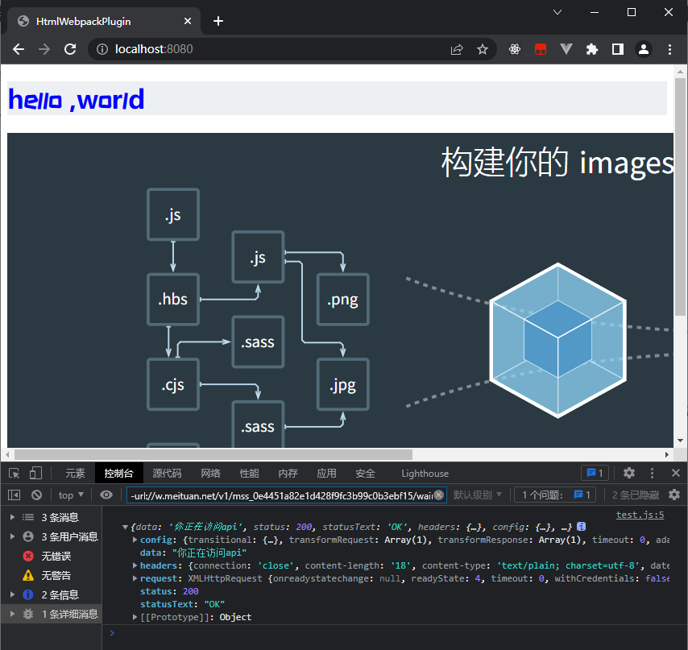

#### 路径重写

按照前面代理的配置

```javascript
proxy: {
  '/api': 'http://localhost:1234'
}
```

你访问`http://localhost:8080/api`会被替换成`http://localhost:1234/api`，如果目标网站没有`api`这个路径，或者我们想把`api`这个换成其他的，例如：

`http://localhost:8080/api` ---> `http://localhost:1234/fuck`

修改koa.js

```javascript
const Koa = require('koa');
const Router = require('@koa/router');
const koa = new Koa();


const router = new Router();
router.get('/api', (ctx) => {
  ctx.body = '你正在访问api'
})

router.get('/fuck', (ctx) => {
  ctx.body = '你就是个 motherfucker';
})

koa.use(router.routes())
// 设置端口为1234，跟网页的不一样就可以形成跨域问题
koa.listen(1234, () => {
  console.log('server is running on http://localhost:1234')
})

```

修改`webpack.config.js`

```javascript
const path = require('path');
const MiniCssExtractPlugin = require("mini-css-extract-plugin");
const HtmlWebpackPlugin = require('html-webpack-plugin');

module.exports = {
  entry: './main.js', // 入口文件
  output: {
    filename: 'build.js', // 输出文件
    path: path.resolve(__dirname, 'dist'), // 输出文件的目录
    clean: true,
  },
  module: {
    rules: [
      {
        test: /\.css$/, // 用于匹配文件
        use: [MiniCssExtractPlugin.loader, 'css-loader', 'postcss-loader'], // loader加载顺序，从右至左，从下往上
      },
      {
        test: /\.scss$/,
        use: [MiniCssExtractPlugin.loader, 'css-loader',  'postcss-loader', 'sass-loader'],
      },
      {
        test: /\.(png|svg|jpg|jpeg|gif)$/i,
        type: 'asset/resource', // webpack5 内置的模块
      },
      {
        test: /\.(woff|woff2|eot|ttf|otf)$/i,
        type: 'asset/resource'
      },
      {
        test: /\.js$/,
        exclude: /node_modules/,
        use: ['babel-loader']
      }
    ]
  },
  mode: 'development',
  plugins: [
    new MiniCssExtractPlugin({
      filename: 'build.css'
    }),
    new HtmlWebpackPlugin(
      {
        title: 'HtmlWebpackPlugin', // 网页的标题
        minify: true, // 是否压缩
      }
    ),
  ],
  devtool: 'inline-source-map',
  watch: false, // 关闭 watch 模式
  devServer: { // 配置 dev server
    static: './dist', // 将dist目录下的文件服务到localhost:8080 下
    hot: true,
    liveReload: false,
    proxy: {
      '/api': {
        target: 'http://localhost:1234',
        pathRewrite: { '^/api': '/fuck' }, // 将/api 重写成 /fuck
      }, 
    }
  },
  resolve: {
    extensions: ['.js', '.json'], // 按照优先级，匹配不带后缀模块
    alias: {
      '@': path.resolve(__dirname, 'src'),
    }
  }
}
```

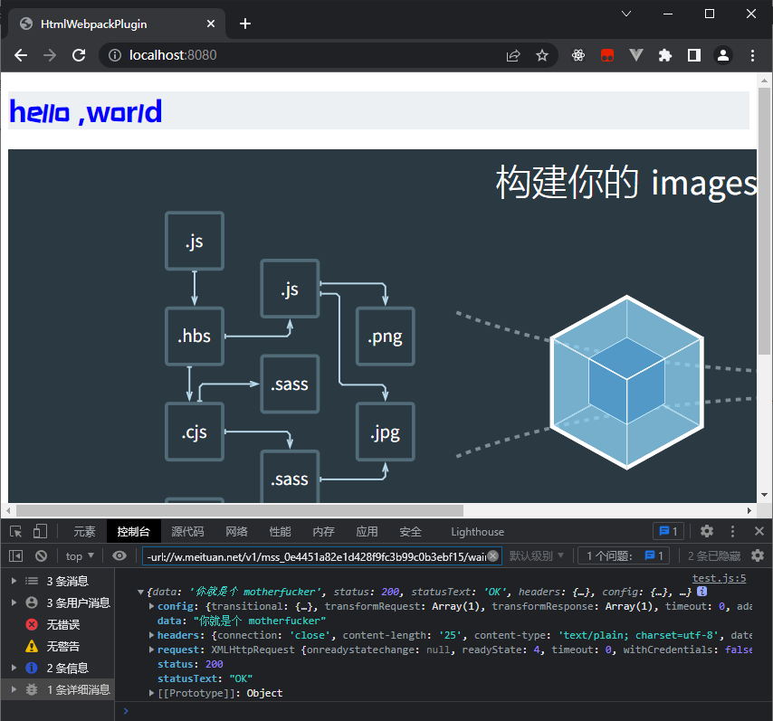