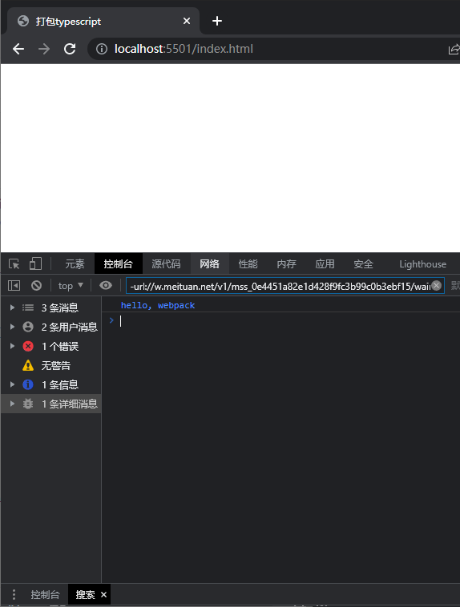
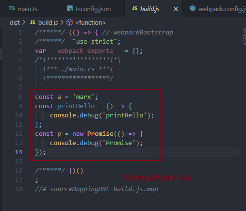
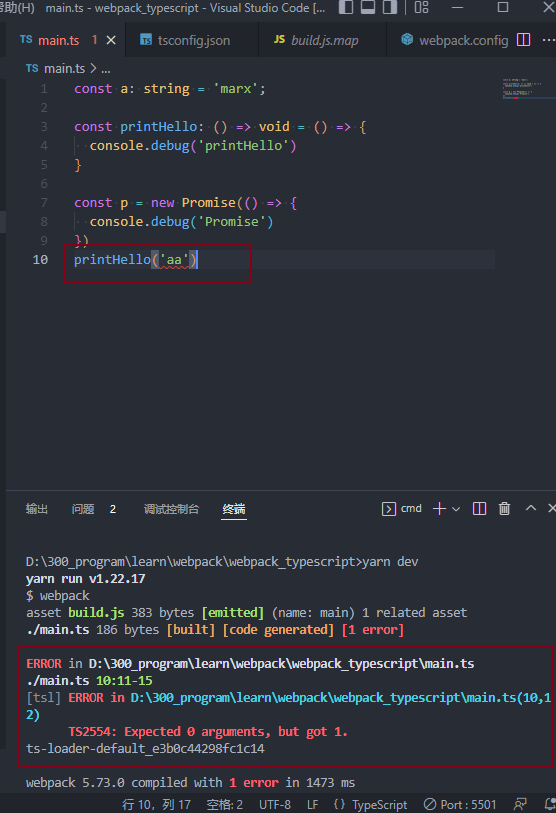
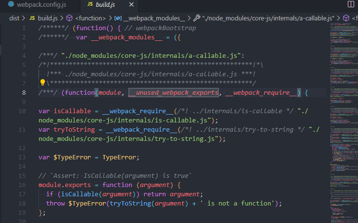
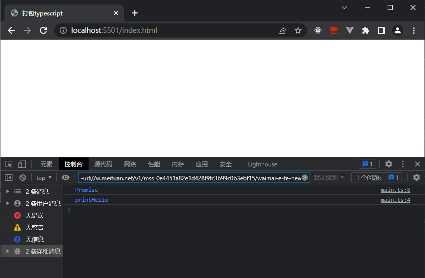
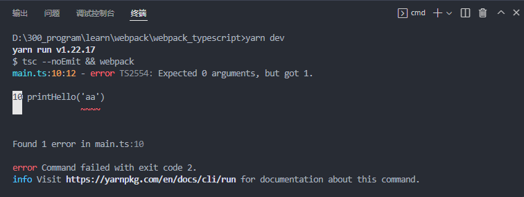
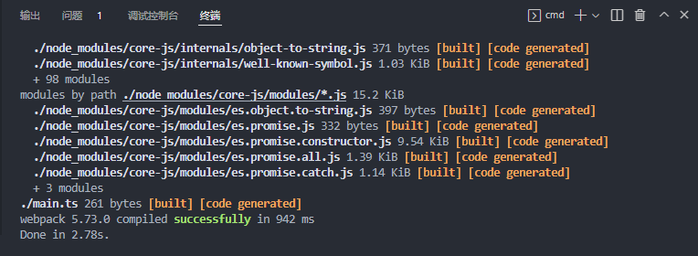

# 打包typescript

**注意**：在写webpack的基本使用，反过来看看笔记，发现了一个致命的问题，就是每一个用例都是在上一个用例的基础上进行修改的，这样子每次用例的技术知识点都是独立的，可是上下文环境并不独立的，当我要查看某一个知识点的时候，不知道它的上下文代码环境，不知道之前的代码内容是什么，也不知道修改了什么。

所以，那篇笔记的写法是有问题的，不利于日常的查看。

正确的应该这么写：将每一个知识点的使用环境独立出来，只使用需要的最基本的条件即可。例如：将打包css和打包图片等用例单独使用一个项目来讲解和记录，日后遇到问题就可以明显查看最基本使用条件和使用方法。

项目名：**webpack_typescript**

## 初始化项目

```
yarn init -y
```

```
yarn add typescript webpack webpack-cli -D
```

```
npx tsc --init
```

```typescript
// 新建 main.ts
console.debug('hello, webpack')
```

```javascript
// 新建 webpack.config.js
const path = require('path');

module.exports = {
  entry: './main.ts', // 入口文件
  output: {
    filename: 'build.js', // 输出文件
    path: path.resolve(__dirname, 'dist'), // 输出文件的目录
    clean: true,
  },
  mode: 'development',
  devtool: 'source-map',
}
```

```html
<!-- 新建 index.html -->
<!DOCTYPE html>
<html lang="en">
<head>
  <meta charset="UTF-8">
  <meta http-equiv="X-UA-Compatible" content="IE=edge">
  <meta name="viewport" content="width=device-width, initial-scale=1.0">
  <title>打包typescript</title>
  <script src="./dist/build.js" defer></script>
</head>
<body>
  
</body>
</html>
```

修改`package.json`

```json
{
  "name": "webpack_typescript",
  "version": "1.0.0",
  "main": "index.js",
  "license": "MIT",
  "scripts": {
    "dev": "webpack"
  },
  "devDependencies": {
    "ts-loader": "^9.3.0",
    "typescript": "^4.7.3"
  }
}
```

## 使用ts-loader

```
yarn add ts-loader -D
```

修改`webpack.config.js`

```javascript
// 新建 webpack.config.js
const path = require('path');

module.exports = {
  entry: './main.ts', // 入口文件
  output: {
    filename: 'build.js', // 输出文件
    path: path.resolve(__dirname, 'dist'), // 输出文件的目录
    clean: true,
  },
  mode: 'development',
  devtool: 'source-map',
  module: {
    rules: [
      {
        test: /\.ts$/,
        loader: 'ts-loader',
      }
    ]
  }
}
```

`yarn dev`



使用 ts-loader 打包的js没有进行向后兼容

修改`main.ts`

```typescript
const a: string = 'marx';

const printHello: () => void = () => {
  console.debug('printHello')
}

const p = new Promise(() => {
  console.debug('Promise')
})
```

`yarn dev`，然后查看 build.js



ts-loader 会进行类型检查，在编译期间出错会直接推出

修改 main.js

```typescript
const a: string = 'marx';

const printHello: () => void = () => {
  console.debug('printHello')
}

const p = new Promise(() => {
  console.debug('Promise')
})
printHello('aa')
```

`yarn dev`



## 使用babel-loader

使用babel来打包 ts 可以解决向后兼容性的问题

```
yarn add @babel/core babel-loader @babel/preset-env @babel/preset-typescript core-js -D
```

```
# 新建 .browserslistrc

> 1% #代表全球超过1%使用的浏览器
last 2 versions # 最新的 2 个主版本
not ie <= 8 #不包含 IE8 及更低的版本

```

```javascript
// 新建 babel.config.js

module.exports = {
  presets: [
    ['@babel/preset-env', { // 配置转换语法
      useBuiltIns: 'usage', // 配置只转换在时代实际使用到的语法和填充api
      corejs: 3, // 使用版本为 3的corejs 来进行 polyfill
    }],
    ['@babel/preset-typescript'], // 用于解析 typescript
  ]
}
```

```javascript
// 修改 webpack.config.js
const path = require('path');

module.exports = {
  entry: './main.ts', // 入口文件
  output: {
    filename: 'build.js', // 输出文件
    path: path.resolve(__dirname, 'dist'), // 输出文件的目录
    clean: true,
  },
  mode: 'development',
  devtool: 'source-map',
  module: {
    rules: [
      {
        test: /\.ts$/,
        loader: 'babel-loader',
      },
    ]
  }
}
```

`yarn dev`，查看 build.js 和 打开浏览器查看效果





这里有一个问题，在bebel-loader不进行类型检查。

## tsc 和 bebel 结合

使用 tsc 和 bebel-loader结合，前者进行类型检查，后者打包转换。

使用 `tsc --noEmit`命令来检查类型并不编译生成文件。

修改 package.json

```
{
  "name": "webpack_typescript",
  "version": "1.0.0",
  "main": "index.js",
  "license": "MIT",
  "scripts": {
    "dev": "tsc --noEmit && webpack"
  },
  "devDependencies": {
    "@babel/core": "^7.18.2",
    "@babel/preset-env": "^7.18.2",
    "@babel/preset-typescript": "^7.17.12",
    "babel-loader": "^8.2.5",
    "core-js": "^3.22.8",
    "ts-loader": "^9.3.0",
    "typescript": "^4.7.3",
    "webpack": "^5.73.0",
    "webpack-cli": "^4.9.2"
  }
}

```

`yarn dev`，编译失败



修改 `main.ts`

```typescript
const a: string = 'marx';

const printHello: () => void = () => {
  console.debug('printHello')
}

const p = new Promise(() => {
  console.debug('Promise')
})
printHello()
```

`yarn dev`，编译成功




代码仓库：https://gitee.com/marx181855/webpack_typescript