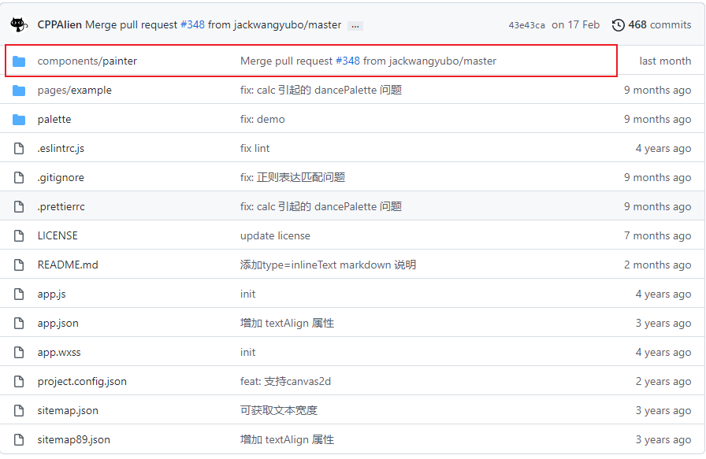
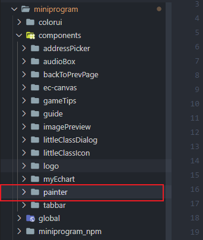
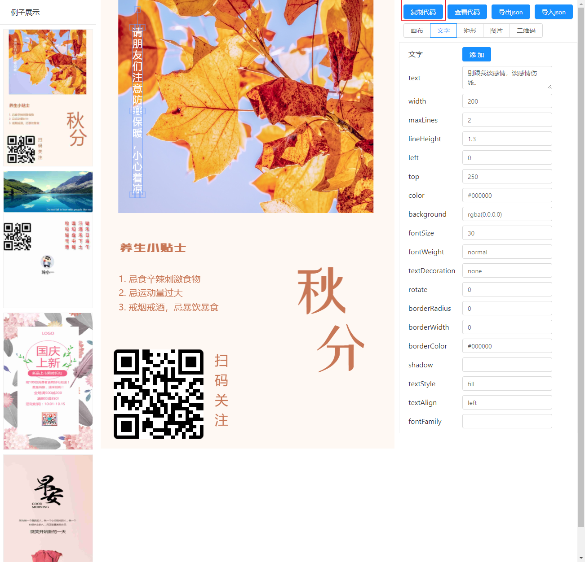
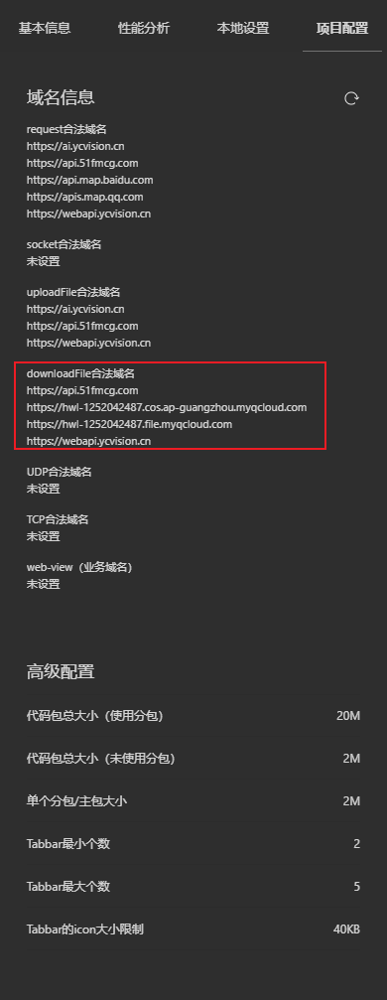

# 小程序生成海报

小程序生成海报有两种方式：

- 前端用 canvas 画出来
- 后端画好发送给前端

开发环境：

- 原生小程序 
- typescript

这个生成海报的需求由前端来完成，如果单纯的使用canvas一点一点的画，耗费的时间精力太大，所以使用[Painter](https://github.com/Kujiale-Mobile/Painter) 第三方库来完成这个功能。

## 基本使用

打开 github 链接，下载代码，将`painter`组件放到项目里面`components`文件夹里面





将 painter 作为自定义组件引入

```json
"usingComponents":{
  "painter":"/components/painter/painter"
}
```

在需要生成海报的页面使用组件，组件接受`palette`属性的 JSON类型数据作为数画图数据来源，通过绑定 imgOK 或 imgErr 事件来获得成功后的图片或失败的原因。

```
# wxml
<painter palette="{{palette}}" bind:imgOK="onImgOK" bind:imgErr="onImgErr"/>
```

```
# ts
onImgOK(e: any) {
  consolde.debug(e.detial.path);
}

onImgErr(e: any) {
  console.error(e);
}
```

`palette`属性的数据规范参考[Palette 规范](https://github.com/Kujiale-Mobile/Painter#palette-规范)

## 使用可视化排版工具

为了提高开发效率，使用可视化布局排版工具来辅助生成海报[可视化工具](https://lingxiaoyi.github.io/painter-custom-poster/)



使用这个工具排版好，当成一个海报模板，然后复制代码，将里面的数据传给组件的`palette`属性

### 使用技巧

实际功能需求，海报的内容并不是固定的，所以我们在排版的过程中，将页面元素需要的动态内容从上往下，从左往右的记录下来，便于使用变量搜索替换。

#### 模板布局


#### position_record.txt

```txt
# position_record.txt
海报元素位置记录，从上往下，从左往右

1 ID

a11111

上左 https://hwl-1252042487.cos.ap-guangzhou.myqcloud.com/idolphin/dolphin/J0029/J0029_20180322QZ03ZR1DX0223.JPG
上右 https://hwl-1252042487.cos.ap-guangzhou.myqcloud.com/idolphin/dolphin/J0029/J0029_20180304QZ03ZR1DX2061_01.JPG

From 2010 To 2022 By 郑锐强

2 GIS

https://hwl-1252042487.cos.ap-guangzhou.myqcloud.com/idolphin/page_image/20220324/16480883552891.png

3 Image

left(11)
https://hwl-1252042487.cos.ap-guangzhou.myqcloud.com/idolphin/dolphin/J0029/J0029_20191020QZ13ZR1DX2228.JPG
https://hwl-1252042487.cos.ap-guangzhou.myqcloud.com/idolphin/dolphin/J0029/J0029_20191013QZ05ZR1DX0356.JPG
https://hwl-1252042487.cos.ap-guangzhou.myqcloud.com/idolphin/dolphin/J0029/J0029_20190916QZ04ZR1DX0645.JPG
https://hwl-1252042487.cos.ap-guangzhou.myqcloud.com/idolphin/dolphin/J0029/J0029_20180825QZ05ZR1DX0541.JPG

right(11)

https://hwl-1252042487.cos.ap-guangzhou.myqcloud.com/idolphin/dolphin/J0029/J0029_20191013QZ05ZR1DX0373.JPG
https://hwl-1252042487.cos.ap-guangzhou.myqcloud.com/idolphin/dolphin/J0029/J0029_20190916QZ04ZR1DX0597.JPG
https://hwl-1252042487.cos.ap-guangzhou.myqcloud.com/idolphin/dolphin/J0029/J0029_20180823QZ02ZR1DX0034-02.JPG
https://hwl-1252042487.cos.ap-guangzhou.myqcloud.com/idolphin/dolphin/J0029/J0029_20180520QZ02ZR1DX0612.JPG

4 DETAILS

108.892121，21.547562
2019-10-20 15:41:04.000
郑锐强
CHINABLUE

https://hwl-1252042487.cos.ap-guangzhou.myqcloud.com/idolphin/page_image/20220324/16481055236449.png
https://hwl-1252042487.cos.ap-guangzhou.myqcloud.com/idolphin/page_image/20220324/16481056302061.png
```

然后将模板数据的动态内容替换成变量

#### postTemplate.ts

```typescript
# postTemplate.ts
interface IOptions {
  lr_image: { img_url: string }[];
  fin_left_image: { img_url: string }[];
  fin_right_image: { img_url: string }[];
  detail: {
    longitude: string;
    latitude: string;
    date: string;
    user_name: string;
    organ: string;
  };
  map_img: string;
  /** logo */
  logo: string;
  /** 二维码 */
  qrcode: string;
  /** 物种编号 */
  PID_number: string;
}

export default function postTemplatePID(options: IOptions) {
  return (
    {
      "width": "375px",
      "height": "1050px",
      "background": "#ffffff",
      "views": [
        {
          "type": "text",
          "text": options.PID_number,
          "css": {
            "color": "#666666",
            "background": "rgba(0,0,0,0)",
            "width": "200px",
            "height": "22.88px",
            "top": "39px",
            "left": "12px",
            "rotate": "0",
            "borderRadius": "",
            "borderWidth": "",
            "borderColor": "#666666",
            "shadow": "",
            "padding": "0px",
            "fontSize": "16px",
            "fontWeight": "normal",
            "maxLines": "2",
            "lineHeight": "23.088000000000005px",
            "textStyle": "fill",
            "textDecoration": "none",
            "fontFamily": "",
            "textAlign": "left"
          }
        },
        {
          "type": "image",
          "url": options.lr_image[0].img_url,
          "css": {
            "width": "175px",
            "height": "80px",
            "top": "66px",
            "left": "9px",
            "rotate": "0",
            "borderRadius": "",
            "borderWidth": "",
            "borderColor": "#000000",
            "shadow": "",
            "mode": "scaleToFill"
          }
        },
        {
          "type": "image",
          "url": options.lr_image[1].img_url,
          "css": {
            "width": "175px",
            "height": "80px",
            "top": "66px",
            "left": "191px",
            "rotate": "0",
            "borderRadius": "",
            "borderWidth": "",
            "borderColor": "#000000",
            "shadow": "",
            "mode": "scaleToFill"
          }
        },
        {
          "type": "text",
          "text": "From 2010 To 2022 By 郑锐强",
          "css": {
            "color": "#aaaaaa",
            "background": "rgba(0,0,0,0)",
            "width": "330px",
            "height": "20.02px",
            "top": "157px",
            "left": "9px",
            "rotate": "0",
            "borderRadius": "",
            "borderWidth": "",
            "borderColor": "",
            "shadow": "",
            "padding": "0px",
            "fontSize": "14px",
            "fontWeight": "normal",
            "maxLines": "2",
            "lineHeight": "20.202000000000005px",
            "textStyle": "fill",
            "textDecoration": "none",
            "fontFamily": "",
            "textAlign": "left"
          }
        },
        {
          "type": "text",
          "text": "2 GIS",
          "css": {
            "color": "#666666",
            "background": "rgba(0,0,0,0)",
            "width": "200px",
            "height": "30.029999999999998px",
            "top": "184px",
            "left": "7px",
            "rotate": "0",
            "borderRadius": "",
            "borderWidth": "",
            "borderColor": "",
            "shadow": "",
            "padding": "0px",
            "fontSize": "21px",
            "fontWeight": "normal",
            "maxLines": "2",
            "lineHeight": "30.303000000000004px",
            "textStyle": "fill",
            "textDecoration": "none",
            "fontFamily": "",
            "textAlign": "left"
          }
        },
        {
          "type": "image",
          "url": options.map_img,
          "css": {
            "width": "360px",
            "height": "360px",
            "top": "210px",
            "left": "7px",
            "rotate": "0",
            "borderRadius": "",
            "borderWidth": "",
            "borderColor": "#000000",
            "shadow": "",
            "mode": "scaleToFill"
          }
        },
        {
          "type": "image",
          "url": options.fin_left_image[0].img_url,
          "css": {
            "width": "88px",
            "height": "60px",
            "top": "624px",
            "left": "4px",
            "rotate": "0",
            "borderRadius": "",
            "borderWidth": "",
            "borderColor": "#000000",
            "shadow": "",
            "mode": "scaleToFill"
          }
        },
        {
          "type": "image",
          "url": options.fin_left_image[1].img_url,
          "css": {
            "width": "88px",
            "height": "60px",
            "top": "624px",
            "left": "95px",
            "rotate": "0",
            "borderRadius": "",
            "borderWidth": "",
            "borderColor": "#000000",
            "shadow": "",
            "mode": "scaleToFill"
          }
        },
        {
          "type": "image",
          "url": options.fin_left_image[2].img_url,
          "css": {
            "width": "88px",
            "height": "60px",
            "top": "624px",
            "left": "187px",
            "rotate": "0",
            "borderRadius": "",
            "borderWidth": "",
            "borderColor": "#000000",
            "shadow": "",
            "mode": "scaleToFill"
          }
        },
        {
          "type": "image",
          "url": options.fin_left_image[3].img_url,
          "css": {
            "width": "88px",
            "height": "60px",
            "top": "624px",
            "left": "280px",
            "rotate": "0",
            "borderRadius": "",
            "borderWidth": "",
            "borderColor": "#000000",
            "shadow": "",
            "mode": "scaleToFill"
          }
        },
        {
          "type": "image",
          "url": options.fin_right_image[0].img_url,
          "css": {
            "width": "88px",
            "height": "60px",
            "top": "722px",
            "left": "5px",
            "rotate": "0",
            "borderRadius": "",
            "borderWidth": "",
            "borderColor": "#000000",
            "shadow": "",
            "mode": "scaleToFill"
          }
        },
        {
          "type": "image",
          "url": options.fin_right_image[1].img_url,
          "css": {
            "width": "88px",
            "height": "60px",
            "top": "722px",
            "left": "96px",
            "rotate": "0",
            "borderRadius": "",
            "borderWidth": "",
            "borderColor": "#000000",
            "shadow": "",
            "mode": "scaleToFill"
          }
        },
        {
          "type": "image",
          "url": options.fin_right_image[2].img_url,
          "css": {
            "width": "88px",
            "height": "60px",
            "top": "723px",
            "left": "188px",
            "rotate": "0",
            "borderRadius": "",
            "borderWidth": "",
            "borderColor": "#000000",
            "shadow": "",
            "mode": "scaleToFill"
          }
        },
        {
          "type": "image",
          "url": options.fin_right_image[3].img_url,
          "css": {
            "width": "88px",
            "height": "60px",
            "top": "723px",
            "left": "281px",
            "rotate": "0",
            "borderRadius": "",
            "borderWidth": "",
            "borderColor": "#000000",
            "shadow": "",
            "mode": "scaleToFill"
          }
        },
        {
          "type": "text",
          "text": "3 IMAGE",
          "css": {
            "color": "#666666",
            "background": "rgba(0,0,0,0)",
            "width": "200px",
            "height": "30.029999999999998px",
            "top": "577px",
            "left": "6px",
            "rotate": "0",
            "borderRadius": "",
            "borderWidth": "",
            "borderColor": "",
            "shadow": "",
            "padding": "0px",
            "fontSize": "21px",
            "fontWeight": "normal",
            "maxLines": "2",
            "lineHeight": "30.303000000000004px",
            "textStyle": "fill",
            "textDecoration": "none",
            "fontFamily": "",
            "textAlign": "left"
          }
        },
        {
          "type": "text",
          "text": "1 ID",
          "css": {
            "color": "#666666",
            "background": "rgba(0,0,0,0)",
            "width": "200px",
            "height": "30.029999999999998px",
            "top": "11.000000000000002px",
            "left": "12px",
            "rotate": "0",
            "borderRadius": "",
            "borderWidth": "",
            "borderColor": "#000000",
            "shadow": "",
            "padding": "0px",
            "fontSize": "21px",
            "fontWeight": "normal",
            "maxLines": "2",
            "lineHeight": "30.303000000000004px",
            "textStyle": "fill",
            "textDecoration": "none",
            "fontFamily": "",
            "textAlign": "left"
          }
        },
        {
          "type": "text",
          "text": "4 DETAILS",
          "css": {
            "color": "#666666",
            "background": "rgba(0,0,0,0)",
            "width": "200px",
            "height": "30.029999999999998px",
            "top": "791px",
            "left": "5px",
            "rotate": "0",
            "borderRadius": "",
            "borderWidth": "",
            "borderColor": "",
            "shadow": "",
            "padding": "0px",
            "fontSize": "21px",
            "fontWeight": "normal",
            "maxLines": "2",
            "lineHeight": "30.303000000000004px",
            "textStyle": "fill",
            "textDecoration": "none",
            "fontFamily": "",
            "textAlign": "left"
          }
        },
        {
          "type": "text",
          "text": "left(11)",
          "css": {
            "color": "#8799a3",
            "background": "rgba(0,0,0,0)",
            "width": "200px",
            "height": "22.88px",
            "top": "604px",
            "left": "7px",
            "rotate": "0",
            "borderRadius": "",
            "borderWidth": "",
            "borderColor": "",
            "shadow": "",
            "padding": "0px",
            "fontSize": "16px",
            "fontWeight": "normal",
            "maxLines": "2",
            "lineHeight": "23.088000000000005px",
            "textStyle": "fill",
            "textDecoration": "none",
            "fontFamily": "",
            "textAlign": "left"
          }
        },
        {
          "type": "text",
          "text": "right(11)",
          "css": {
            "color": "#8799a3",
            "background": "rgba(0,0,0,0)",
            "width": "200px",
            "height": "22.88px",
            "top": "698px",
            "left": "4px",
            "rotate": "0",
            "borderRadius": "",
            "borderWidth": "",
            "borderColor": "",
            "shadow": "",
            "padding": "0px",
            "fontSize": "16px",
            "fontWeight": "normal",
            "maxLines": "2",
            "lineHeight": "23.088000000000005px",
            "textStyle": "fill",
            "textDecoration": "none",
            "fontFamily": "",
            "textAlign": "left"
          }
        },
        {
          "type": "rect",
          "css": {
            "background": "#f8d4d4",
            "width": "0px",
            "height": "0px",
            "top": "260px",
            "left": "462px",
            "rotate": "0",
            "borderRadius": "4px",
            "borderWidth": "2px",
            "borderColor": "#ff0000",
            "shadow": "",
            "color": "#f8d4d4"
          }
        },
        {
          "type": "rect",
          "css": {
            "background": "#f8d4d4",
            "width": "2px",
            "height": "2px",
            "top": "260px",
            "left": "462px",
            "rotate": "0",
            "borderRadius": "4px",
            "borderWidth": "2px",
            "borderColor": "#ff0000",
            "shadow": "",
            "color": "#f8d4d4"
          }
        },
        {
          "type": "text",
          "text": "经纬度：",
          "css": {
            "color": "#666666",
            "background": "rgba(0,0,0,0)",
            "width": "91px",
            "height": "22.88px",
            "top": "824px",
            "left": "20px",
            "rotate": "0",
            "borderRadius": "",
            "borderWidth": "",
            "borderColor": "",
            "shadow": "",
            "padding": "0px",
            "fontSize": "16px",
            "fontWeight": "normal",
            "maxLines": "2",
            "lineHeight": "23.088000000000005px",
            "textStyle": "fill",
            "textDecoration": "none",
            "fontFamily": "",
            "textAlign": "left"
          }
        },
        {
          "type": "text",
          "text": "时间：",
          "css": {
            "color": "#666666",
            "background": "rgba(0,0,0,0)",
            "width": "91px",
            "height": "22.88px",
            "top": "854px",
            "left": "21px",
            "rotate": "0",
            "borderRadius": "",
            "borderWidth": "",
            "borderColor": "",
            "shadow": "",
            "padding": "0px",
            "fontSize": "16px",
            "fontWeight": "normal",
            "maxLines": "2",
            "lineHeight": "23.088000000000005px",
            "textStyle": "fill",
            "textDecoration": "none",
            "fontFamily": "",
            "textAlign": "left"
          }
        },
        {
          "type": "text",
          "text": "拍摄者：",
          "css": {
            "color": "#666666",
            "background": "rgba(0,0,0,0)",
            "width": "91px",
            "height": "22.88px",
            "top": "885px",
            "left": "18px",
            "rotate": "0",
            "borderRadius": "",
            "borderWidth": "",
            "borderColor": "",
            "shadow": "",
            "padding": "0px",
            "fontSize": "16px",
            "fontWeight": "normal",
            "maxLines": "2",
            "lineHeight": "23.088000000000005px",
            "textStyle": "fill",
            "textDecoration": "none",
            "fontFamily": "",
            "textAlign": "left"
          }
        },
        {
          "type": "text",
          "text": "组织：",
          "css": {
            "color": "#666666",
            "background": "rgba(0,0,0,0)",
            "width": "91px",
            "height": "22.88px",
            "top": "921px",
            "left": "20px",
            "rotate": "0",
            "borderRadius": "",
            "borderWidth": "",
            "borderColor": "",
            "shadow": "",
            "padding": "0px",
            "fontSize": "16px",
            "fontWeight": "normal",
            "maxLines": "2",
            "lineHeight": "23.088000000000005px",
            "textStyle": "fill",
            "textDecoration": "none",
            "fontFamily": "",
            "textAlign": "left"
          }
        },
        {
          "type": "text",
          "text": options.detail.longitude + ', ' + options.detail.latitude,
          "css": {
            "color": "#8799a3",
            "background": "rgba(0,0,0,0)",
            "width": "200px",
            "height": "22.88px",
            "top": "824px",
            "left": "97px",
            "rotate": "0",
            "borderRadius": "",
            "borderWidth": "",
            "borderColor": "#000000",
            "shadow": "",
            "padding": "0px",
            "fontSize": "16px",
            "fontWeight": "normal",
            "maxLines": "2",
            "lineHeight": "23.088000000000005px",
            "textStyle": "fill",
            "textDecoration": "none",
            "fontFamily": "",
            "textAlign": "left"
          }
        },
        {
          "type": "text",
          "text": options.detail.date,
          "css": {
            "color": "#8799a3",
            "background": "rgba(0,0,0,0)",
            "width": "200px",
            "height": "22.88px",
            "top": "855px",
            "left": "97px",
            "rotate": "0",
            "borderRadius": "",
            "borderWidth": "",
            "borderColor": "#000000",
            "shadow": "",
            "padding": "0px",
            "fontSize": "16px",
            "fontWeight": "normal",
            "maxLines": "2",
            "lineHeight": "23.088000000000005px",
            "textStyle": "fill",
            "textDecoration": "none",
            "fontFamily": "",
            "textAlign": "left"
          }
        },
        {
          "type": "text",
          "text": options.detail.organ,
          "css": {
            "color": "#8799a3",
            "background": "rgba(0,0,0,0)",
            "width": "200px",
            "height": "22.88px",
            "top": "920px",
            "left": "97px",
            "rotate": "0",
            "borderRadius": "",
            "borderWidth": "",
            "borderColor": "#000000",
            "shadow": "",
            "padding": "0px",
            "fontSize": "16px",
            "fontWeight": "normal",
            "maxLines": "2",
            "lineHeight": "23.088000000000005px",
            "textStyle": "fill",
            "textDecoration": "none",
            "fontFamily": "",
            "textAlign": "left"
          }
        },
        {
          "type": "text",
          "text": "爱海豚（iDOLPHIN）公益计划",
          "css": {
            "color": "#666666",
            "background": "rgba(0,0,0,0)",
            "width": "200px",
            "height": "20.02px",
            "top": "1014px",
            "left": "90px",
            "rotate": "0",
            "borderRadius": "",
            "borderWidth": "",
            "borderColor": "#000000",
            "shadow": "",
            "padding": "0px",
            "fontSize": "14px",
            "fontWeight": "normal",
            "maxLines": "2",
            "lineHeight": "20.202000000000005px",
            "textStyle": "fill",
            "textDecoration": "none",
            "fontFamily": "",
            "textAlign": "left"
          }
        },
        {
          "type": "image",
          "url": options.logo,
          "css": {
            "width": "56.5px",
            "height": "56.5px",
            "top": "977.5px",
            "left": "31px",
            "rotate": "0",
            "borderRadius": "",
            "borderWidth": "",
            "borderColor": "#000000",
            "shadow": "",
            "mode": "scaleToFill"
          }
        },
        {
          "type": "image",
          "url": options.qrcode,
          "css": {
            "width": "80px",
            "height": "80px",
            "top": "962px",
            "left": "287px",
            "rotate": "0",
            "borderRadius": "",
            "borderWidth": "",
            "borderColor": "#000000",
            "shadow": "",
            "mode": "scaleToFill"
          }
        },
        {
          "type": "text",
          "text": options.detail.user_name,
          "css": {
            "color": "#8799a3",
            "background": "rgba(0,0,0,0)",
            "width": "200px",
            "height": "22.88px",
            "top": "884px",
            "left": "97px",
            "rotate": "0",
            "borderRadius": "",
            "borderWidth": "",
            "borderColor": "#000000",
            "shadow": "",
            "padding": "0px",
            "fontSize": "16px",
            "fontWeight": "normal",
            "maxLines": "2",
            "lineHeight": "23.088000000000005px",
            "textStyle": "fill",
            "textDecoration": "none",
            "fontFamily": "",
            "textAlign": "left"
          }
        }
      ]
    }
  );
}
```

## 注意：

生成海报如果使用图片，Painter 会将图片下载到本地，所以需要在开发平台配置 downloadFile 域名，配置图片的域名。



## 参考代码片段

https://developers.weixin.qq.com/s/jiEZu4m17z9b

## 高级用法

高级用法可以参考[github]([Kujiale-Mobile/Painter: 小程序生成图片库，轻松通过 json 方式绘制一张可以发到朋友圈的图片 (github.com)](https://github.com/Kujiale-Mobile/Painter))

## 参考链接

[Painter 一款轻量级的小程序海报生成组件 | 微信开放社区 (qq.com)](https://developers.weixin.qq.com/community/develop/doc/000048447844f80b9107d64ab51006)

[Kujiale-Mobile/Painter: 小程序生成图片库，轻松通过 json 方式绘制一张可以发到朋友圈的图片 (github.com)](https://github.com/Kujiale-Mobile/Painter#palette-规范)

[React App (lingxiaoyi.github.io)](https://lingxiaoyi.github.io/painter-custom-poster/)

