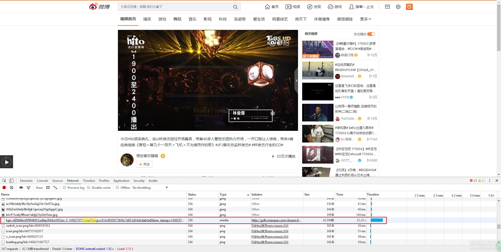
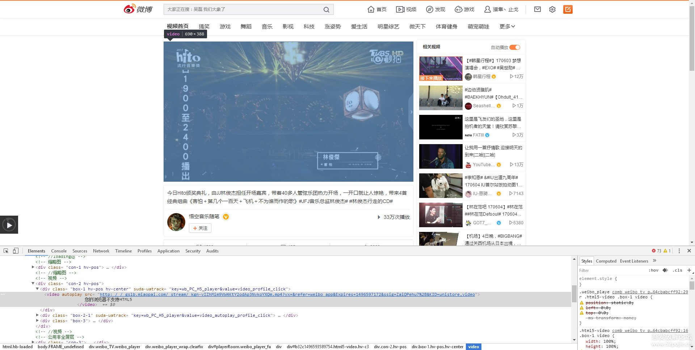
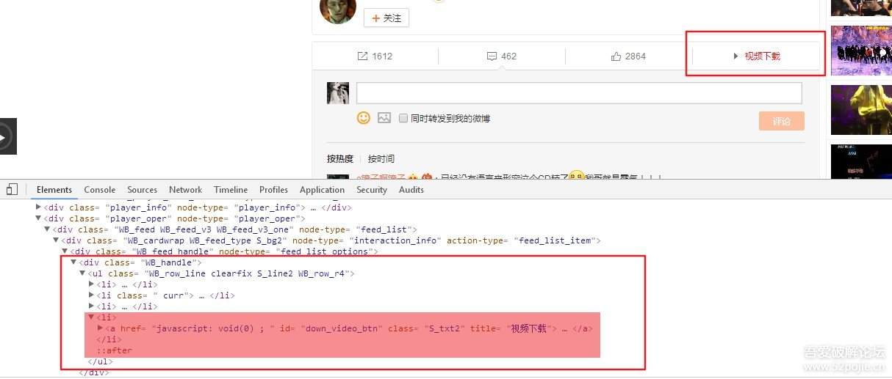

# 油猴Tampermonkey

## 一、介绍
Tampermonkey是一个浏览器插件，Tampermonkey通过加载第三方的脚本文件，改变页面中的CSS和JS元素，可以让整个网页大变样，也可以在网页中增加额外的功能。

Tampermonkey文档：https://www.tampermonkey.net/documentation.php?version=4.8.41&ext=dhdg&show=dhdg#_homepage

## 二、安装


Tampermonkey下载

常用浏览器安装：

     搜狗浏览器：       http://ie.sogou.com/app/search/Tampermonkey
     360安全浏览器： https://ext.se.360.cn/webstore/search/tampermonkey
     360极速浏览器：https://ext.chrome.360.cn/webstore/search/tampermonkey
     火狐浏览器：       https://addons.mozilla.org/zh-CN/firefox/addon/tampermonkey/?src=search
     遨游浏览器：      http://extension.maxthon.cn/detail/index.php?view_id=1680&category_id=
     欧朋浏览器：     https://addons.opera.com/zh-cn/extensions/details/tampermonkey-beta/?display=en
## 三、编写脚本


```javascript
// ==UserScript==
// @name         New Userscript
// @namespace    http://tampermonkey.net/
// @version      0.1
// @description  try to take over the world!
// @author       You
// @match        http://*/*
// @grant        none
// ==/UserScript==
(function() {
    'use strict';
    // Your code here...
})();
```
@name就是脚本名，@namespace是脚本的主页，@version是版本，@description是介绍，@author是作者，@match是匹配到什么页面执行此脚本，@grant是需求权限。其他属性在 油猴的文档 里可以看到。

中间那个 // Your code here... 就是放置代码的地方，这些代码会在页面加载完毕后运行。
这个脚本会在每次打开我的博客的任意页面的时候，弹出对话框，显示“Hello, world!”。在油猴编辑器里可以使用文件菜单来保存，也可以直接Ctrl+S。保存后的脚本会出现在已安装脚本中。来打开我的博客首页看一下效果。
同时，油猴脚本的图标上会出现小红点，上面写着“1”，表示当前页面有1个脚本正在运行。

以 微博视频（http://weibo.com/tv/movie） 的下载辅助为例子。




在没有下载工具的情况下，以上的图片就是我们常用的下载方式。既然发现了包含mp4字样的链接地址，不妨继续到网页标签元素中在探索一番，说不定还会有其它的收获。


真让人惊喜，video元素中竟然有视频直链。既然这样，我们只需要获取到video的src属性，再往页面上添加个下载按钮就能撇弃资源嗅探的繁琐下载方式了！！！
思路已经想好了，那么就开始动手写代码吧。

### 第一步，先把最基本的框架搭好。

```javascript
// ==UserScript==
// @icon            http://weibo.com/favicon.ico
// @name            微博视频下载助手
// @namespace       [url=mailto:1649991905@qq.com]1649991905@qq.com[/url]
// @author          猎隼丶止戈
// @description     下载微博视频
// @match           *://weibo.com/tv/v/*
// @require         http://cdn.bootcss.com/jquery/1.8.3/jquery.min.js
// @version         0.0.1
// @grant           GM_addStyle
// ==/UserScript==
(function () {
    'use strict';
})();
```
### 第二步，编写下载弹出框与获取文件名的工具对象

```javascript
var videoTool = {
    //获取文件名
    getFileName: function (url, rule_start, rule_end) {
            var start = url.lastIndexOf(rule_start) + 1;
            var end = url.lastIndexOf(rule_end);
            return url.substring(start, end);
        },
        //弹出下载框
        download: function (videoUrl, name) {
            var content = "file content!";
            var data = new Blob([content], {
                type: "text/plain;charset=UTF-8"
            });
            var downloadUrl = window.URL.createObjectURL(data);
            var anchor = document.createElement("a");
            anchor.href = videoUrl;
            anchor.download = name;
            anchor.click();
            window.URL.revokeObjectURL(data);
        }
};
```
### 第三步，生成一个下载按钮，并嵌入页面

```javascript
//与元数据块中的@grant值相对应，功能是生成一个style样式
GM_addStyle('#down_video_btn{color:#fa7d3c;}');
//视频下载按钮的html代码
var down_btn_html = '<li>';
down_btn_html += '<a href="javascript:void(0);" id="down_video_btn" class="S_txt2" title="视频下载">';
down_btn_html += '<span class="pos">';
down_btn_html += '<span class="line S_line1" node-type="comment_btn_text">';
down_btn_html += '<span>';
down_btn_html += '<em class="W_ficon ficon_video_v2 S_ficon">i</em>';
down_btn_html += '<em>视频下载</em>';
down_btn_html += '</span>';
down_btn_html += '</span>';
down_btn_html += '</span>';
down_btn_html += ' <span class="arrow"><span class="W_arrow_bor W_arrow_bor_t"><i class="S_line1"></i><em class="S_bg1_br"></em></span></span>';
down_btn_html += ' </li>';
//将以上拼接的html代码插入到网页里的ul标签中
var ul_tag = $("div.WB_handle>ul");
if (ul_tag) {
    ul_tag.removeClass("WB_row_r3").addClass("WB_row_r4").append(down_btn_html);
}
```
图片说明：

效果图：

最后一步，获取播放器（video）对象中的视频地址并编写下载按钮的单击事件
```javascript
$(function () {
    //获取播放器（video）对象
    var video = $("video");
    var video_url = null;
    if (video) {
        video_url = video.attr("src"); //获取视频链接地址
    }
    //执行下载按钮的单击事件并调用下载函数
    $("#down_video_btn").click(function () {
        if (video_url) {
            videoTool.download(video_url, videoTool.getFileName(video_url, "/", "?"));
        }
    });
});
```
完整代码及效果演示：

```javascript
// ==UserScript==
// @icon            http://weibo.com/favicon.ico
// @name            微博视频下载助手
// @namespace       [url=mailto:1649991905@qq.com]1649991905@qq.com[/url]
// @author          猎隼丶止戈
// @description     下载微博视频
// @match           *://weibo.com/tv/v/*
// @require         http://cdn.bootcss.com/jquery/1.8.3/jquery.min.js
// @version         0.0.1
// @grant           GM_addStyle
// ==/UserScript==
(function () {
    'use strict';
    //与元数据块中的@grant值相对应，功能是生成一个style样式
    GM_addStyle('#down_video_btn{color:#fa7d3c;}');
    //视频下载按钮的html代码
    var down_btn_html = '<li>';
    down_btn_html += '<a href="javascript:void(0);" id="down_video_btn" class="S_txt2" title="视频下载">';
    down_btn_html += '<span class="pos">';
    down_btn_html += '<span class="line S_line1" node-type="comment_btn_text">';
    down_btn_html += '<span>';
    down_btn_html += '<em class="W_ficon ficon_video_v2 S_ficon">i</em>';
    down_btn_html += '<em>视频下载</em>';
    down_btn_html += '</span>';
    down_btn_html += '</span>';
    down_btn_html += '</span>';
    down_btn_html += ' <span class="arrow"><span class="W_arrow_bor W_arrow_bor_t"><i class="S_line1"></i><em class="S_bg1_br"></em></span></span>';
    down_btn_html += ' </li>';
    //将以上拼接的html代码插入到网页里的ul标签中
    var ul_tag = $("div.WB_handle>ul");
    if (ul_tag) {
        ul_tag.removeClass("WB_row_r3").addClass("WB_row_r4").append(down_btn_html);
    }
    var videoTool = {
        //获取文件名
        getFileName: function (url, rule_start, rule_end) {
                var start = url.lastIndexOf(rule_start) + 1;
                var end = url.lastIndexOf(rule_end);
                return url.substring(start, end);
            },
            //弹出下载框
            download: function (videoUrl, name) {
                var content = "file content!";
                var data = new Blob([content], {
                    type: "text/plain;charset=UTF-8"
                });
                var downloadUrl = window.URL.createObjectURL(data);
                var anchor = document.createElement("a");
                anchor.href = videoUrl;
                anchor.download = name;
                anchor.click();
                window.URL.revokeObjectURL(data);
            }
    };
    $(function () {
        //获取播放器（video）对象
        var video = $("video");
        var video_url = null;
        if (video) {
            video_url = video.attr("src"); //获取视频链接地址
        }
        //执行下载按钮的单击事件并调用下载函数
        $("#down_video_btn").click(function () {
            if (video_url) {
                videoTool.download(video_url, videoTool.getFileName(video_url, "/", "?"));
            }
        });
    });
})();


```


